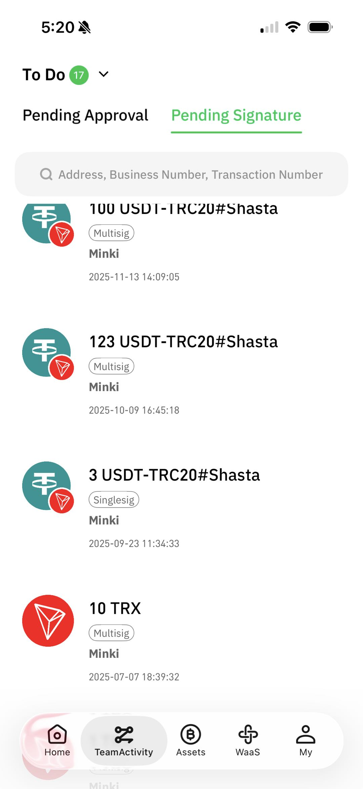
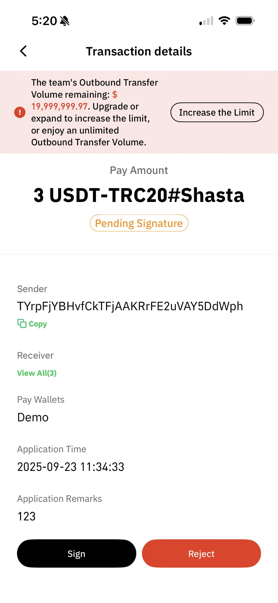
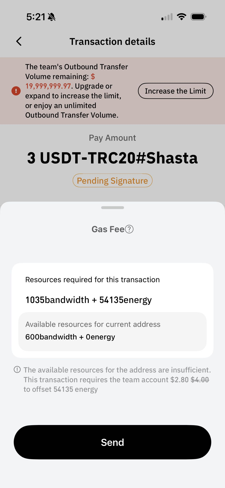
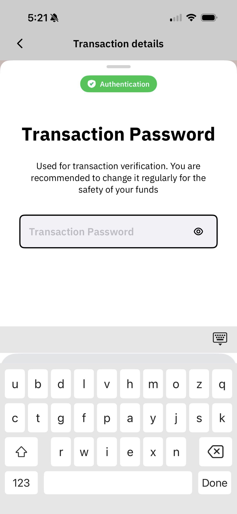
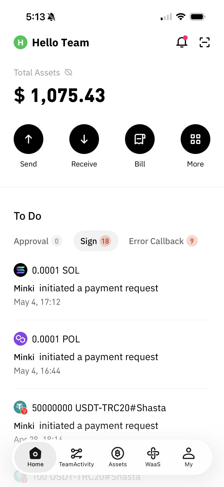
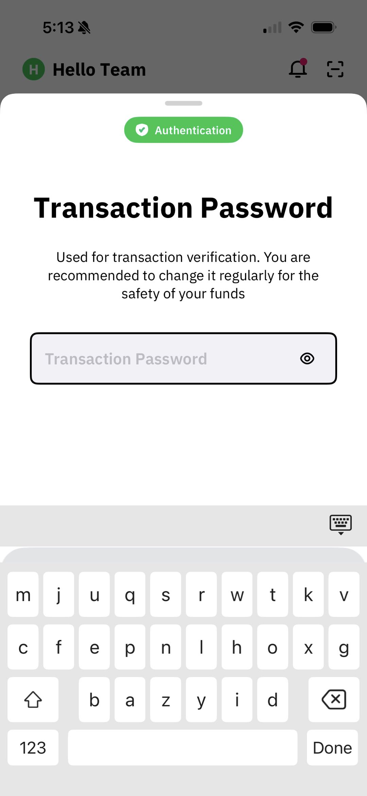
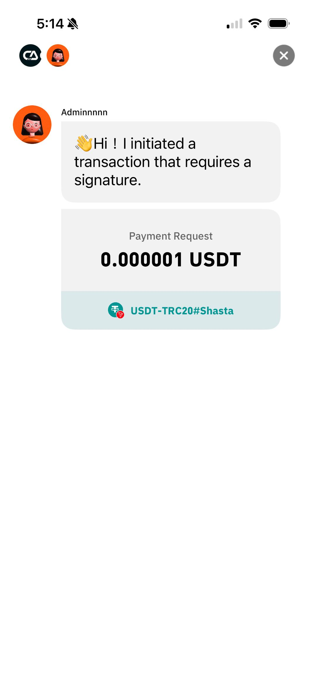
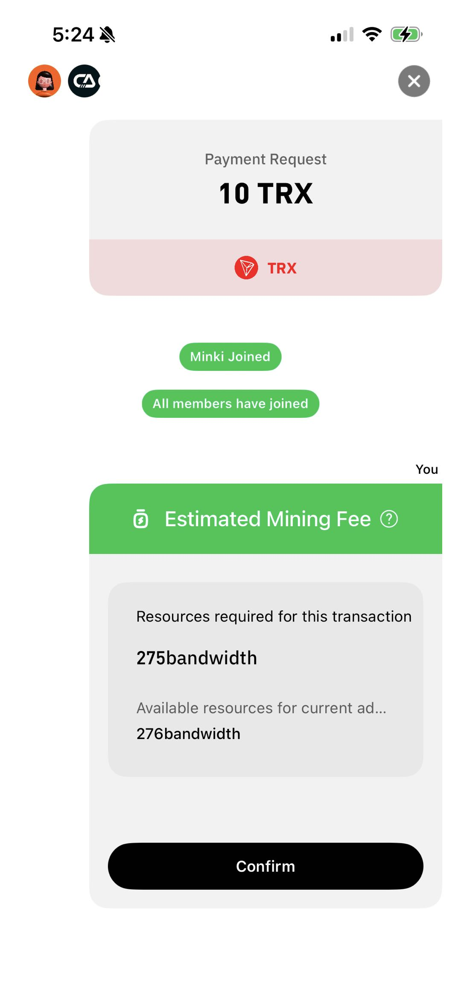

# Signing

Once a transaction completes the necessary approval process, it enters the signing stage. When a transaction meets the signing conditions and the current account possesses signing permissions, it is routed to Tasks > Signatures. Signers can sign or reject the transaction. Cregis supports both single-transaction signing and batch signing to help teams process pending transactions efficiently. Once signed, you can view the processed signature history under Tasks > Signed.

**Important Notes**

* If the recipient address is blacklisted, the transaction can only be rejected; signing is not permitted.
* Batch signing only supports transactions of the same cryptocurrency in a single operation. Mixed-currency batch signing is not supported.
* Batch signing only supports single-recipient transfers initiated by single-sig wallets and transactions initiated via API.
* Transactions initiated by multi-sig wallets, Swap applications, or batch transfer functions do not support batch signing and must be processed individually.

## Single-Transaction Signing

Because signing mechanisms differ between single-sig and multi-sig wallets, single-transaction signing is processed based on the outgoing wallet type.

### **Single‑Signature Wallet Transaction Signing**

#### **Cregis Desktop**

For transactions initiated by a single-sig wallet, only one person is required to execute the signature. Navigate to Tasks > Signature, locate the transaction, and click Review on the right side.

<figure><figcaption></figcaption></figure>

On the signature details page, review the transaction details and choose an action:

* **Sign**: Authorize the transaction for execution.
* **Reject**: Decline the transaction and stop the signing process. _(Note: If the recipient is a blacklisted address, you can only select Reject.)_

<figure><figcaption></figcaption></figure>

Click Sign. In the gas fee pop-up window, confirm the gas fee and click Confirm.

<figure><figcaption></figcaption></figure>

Perform identity verification: enter your Transaction Password and click Confirm.

<figure><figcaption></figcaption></figure>

After verification, you will be directed to the signing page. Upon successful signing, the system automatically broadcasts the transaction to the blockchain and displays a success prompt.

<figure><figcaption></figcaption></figure>

#### **Cregis Mobile**

You can see pending signature items from the Home Page's To-Do section or from **Tasks**. Click on an item to view the transaction details. After confirming the signature, the estimated **Gas Fee** will be displayed.

<figure><figcaption></figcaption></figure> <figure><figcaption></figcaption></figure> <figure><figcaption></figcaption></figure>

After clicking Send, you need to complete the transaction password verification. The signing is then successfully completed.

<figure><figcaption></figcaption></figure>

### **Multi-Signature Wallet Transaction Signing**

#### **Cregis Desktop**

Multi-sig wallet transactions must satisfy the wallet's configured signature threshold. Navigate to Tasks > Signature, select the target multi-sig transaction, and click Review.

<figure><figcaption></figcaption></figure>

Review the transaction details and choose an action:

* **Sign**: Authorize the transaction (requires participation from other signers).
* **Reject**: Decline the transaction and stop the signing process. _(Note: If the recipient is blacklisted, you can only select Reject.)_

<figure><figcaption></figcaption></figure>

Click Sign, enter your Transaction Password, and click Confirm.

<figure><figcaption></figcaption></figure>

After verification, you will enter a waiting page. You must wait for other wallet members to join until the signature threshold is met.

<figure><figcaption></figcaption></figure>

Once the signature request is initiated, other online members of the wallet will receive an invitation notification.&#x20;

<figure><figcaption></figcaption></figure>

They must click Multi-Sig Invitation, review the details, and click Join.

<figure><figcaption></figcaption></figure>

Joining members must complete identity verification by entering their Transaction Password and clicking Confirm.

<figure><figcaption></figcaption></figure>

When the number of participating members reaches the required threshold, the initiator clicks Confirm.

<figure><figcaption></figcaption></figure>

In the gas fee pop-up window, confirm the gas fee and click Confirm.

<figure><figcaption></figcaption></figure>

Enter the transaction signing page. Upon successful signing, the system automatically broadcasts the transaction to the blockchain and displays a success prompt.

<figure><figcaption></figcaption></figure>

#### **Cregis Mobile App**

You can see pending signature items from the Home Page's To-Do section or from **Tasks**. Click on an item to view the transaction details. After confirming the signature, you will need to verify the transaction password.

<figure><figcaption></figcaption></figure> <figure><figcaption></figcaption></figure> <figure><figcaption></figcaption></figure>

Once verification is complete, you will enter the multi‑signature process. **If you are the initiator**, you can see which members have joined.\
When the number of joined multi‑signature signers reaches the minimum signing threshold, the signature initiator will see the estimated Gas Fee and can confirm it.

<figure><figcaption></figcaption></figure> <figure><figcaption></figcaption></figure>

## Batch Signing

Navigate to Tasks > Signature and click Batch Process in the top right corner.

<figure><figcaption></figcaption></figure>

Select the cryptocurrency you wish to batch sign and click View.

<figure><figcaption></figcaption></figure>

Select the target transactions and choose an action:

* **Sign**: Authorize the execution of selected transactions.
* **Reject**: Decline selected transactions and stop the signing process.

<figure><figcaption></figcaption></figure>

Click Sign. Review the summary statistics for the batch operation and click Confirm.

<figure><figcaption></figcaption></figure>

In the gas fee pop-up window, confirm the gas fee and click Confirm.

<figure><figcaption></figcaption></figure>

Enter your Transaction Password for identity verification and click Confirm.

<figure><figcaption></figcaption></figure>

Upon successful verification, the system executes the batch signing process.

<figure><figcaption></figcaption></figure>

When handling multiple pending signatures, use batch signing to process multiple transactions at once.

<figure><figcaption></figcaption></figure>

 
