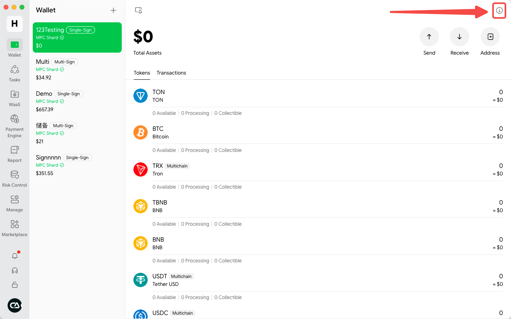

# Why Can't I See the Team Wallet?

Wallets have independent permission settings. If you are not added as a wallet member, you will not have access to view the wallet. The wallet creator can manage wallet permissions by following these steps:

**Select the Wallet** and navigate to the **Settings** page. Locate the entry for **Wallet Members**.

<figure><figcaption></figcaption></figure>

In the Wallet Members section, you can add or remove members, as well as edit their permissions.

<figure><figcaption></figcaption></figure>

The following permissions can be customized within the wallet:

<figure><figcaption></figcaption></figure>

