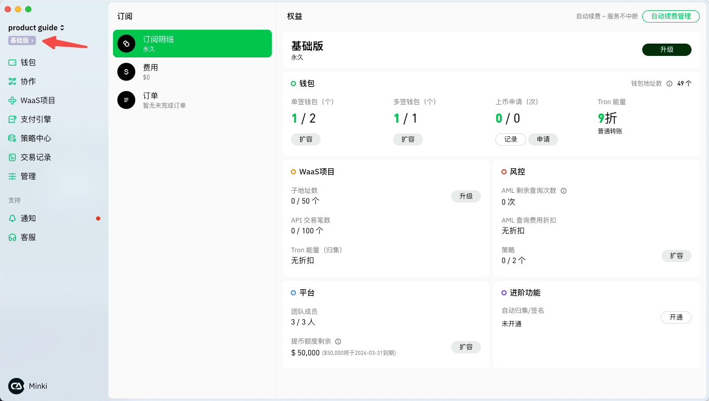

# 管理团队版本

## **Cregis团队版本**

<table><thead><tr><th width="185.42578125">功能/版本</th><th>基础版</th><th>高级版</th><th>商业版</th><th>企业版</th></tr></thead><tbody><tr><td><strong>MPC 单签钱包</strong></td><td>2个</td><td>5个</td><td>10个</td><td>不限</td></tr><tr><td><strong>MPC 多签钱包</strong></td><td>1个</td><td>2个</td><td>5个</td><td>不限</td></tr><tr><td><strong>Tron能量（普通转账）</strong></td><td>9折</td><td>8.5折</td><td>7折</td><td>不限</td></tr><tr><td><strong>自主Token上币</strong></td><td>0次</td><td>2次</td><td>5次</td><td>不限</td></tr><tr><td><strong>分片管理</strong></td><td>支持</td><td>支持</td><td>支持</td><td>支持</td></tr><tr><td><strong>账单管理</strong></td><td>支持</td><td>支持</td><td>支持</td><td>支持</td></tr><tr><td><strong>批量转账</strong></td><td>支持</td><td>支持</td><td>支持</td><td>支持</td></tr><tr><td><strong>钱包地址</strong></td><td>49个</td><td>99个</td><td>1,999个</td><td>不限</td></tr><tr><td><strong>团队成员</strong></td><td>3人</td><td>10人</td><td>20人</td><td>不限</td></tr><tr><td><strong>累计提币额度（每月）</strong></td><td>$50,000</td><td>$2,500,000</td><td>$20,000,000</td><td>不限</td></tr><tr><td><strong>提币超额费用</strong></td><td>0.1%</td><td>0.08%</td><td>0.05%</td><td>不限</td></tr><tr><td><strong>WaaS子地址</strong></td><td>50个</td><td>100个</td><td>2,000个</td><td>不限</td></tr><tr><td><strong>API交易笔数（每月）</strong></td><td>100笔</td><td>10,000笔</td><td>100,000笔</td><td>不限</td></tr><tr><td><strong>Tron能量（归集）</strong></td><td>无折扣</td><td>9折</td><td>7.5折</td><td>7折</td></tr><tr><td><strong>策略</strong></td><td>2个</td><td>5个</td><td>10个</td><td>不限</td></tr><tr><td><strong>手动AML功能</strong></td><td>支持</td><td>支持</td><td>支持</td><td>支持</td></tr><tr><td><strong>AML查询工具</strong></td><td>无折扣</td><td>8折</td><td>6折</td><td>5折</td></tr><tr><td><strong>自动AML功能</strong></td><td>支持</td><td>支持</td><td>支持</td><td>支持</td></tr><tr><td><strong>自动归集 /</strong> <strong>签名</strong></td><td>$500/月</td><td>$500/月</td><td>$500/月  年付免费</td><td>免费</td></tr></tbody></table>

## 功能说明

您可参考以下功能说明，部份功能支持额外付费扩容，扩容操作可参考[这里](feature_activation.md)。

<table><thead><tr><th width="189.7578125">功能</th><th width="442.859375">说明</th><th width="361.5390625">是否可扩容</th></tr></thead><tbody><tr><td><strong>MPC 单签钱包</strong></td><td>可创建的单签钱包数量</td><td>可以$99/个单签钱包进行扩容</td></tr><tr><td><strong>MPC 多签钱包</strong></td><td>可创建的多签钱包数量</td><td>可以$99/个多签钱包进行扩容</td></tr><tr><td><strong>Tron能量（普通转账）</strong></td><td>普通钱包使用TRON网络交易走能量模式时享用的折扣</td><td>不支持扩容</td></tr><tr><td><strong>自主Token上币</strong></td><td>可申请申请将新代币上架平台的次数，一旦代币成功上架，只有申请该代币的团队才能使用该代币进行交易。</td><td>可以$350/次进行额外的上币申请</td></tr><tr><td><strong>分片管理</strong></td><td>钱包内分片管理，包括重置、授权分片等功能</td><td>不支持扩容</td></tr><tr><td><strong>账单管理</strong></td><td>支持导出钱包交易记录</td><td>不支持扩容</td></tr><tr><td><strong>批量转账</strong></td><td>支持发起批量转出交易</td><td>不支持扩容</td></tr><tr><td><strong>钱包地址</strong></td><td>每个钱包在每个网络下可创建的地址，例如基础版团队每个钱包只可以创建49个TRON网络的地址</td><td>不支持扩容</td></tr><tr><td><strong>团队成员</strong></td><td>每个团队的成员数</td><td>不支持扩容</td></tr><tr><td><strong>累计提币额度（每月）</strong></td><td>每月提币额度，额度会按月清算，归集及团队账户充值的交易不消耗提币额度</td><td>可按需要为提币额度进行扩容，扩容部份为永久，提币时将优先消耗团队赠送部份</td></tr><tr><td><strong>提币超额费用</strong></td><td>转账超过提币额度时需按超额部份支付的费用</td><td>不支持扩容</td></tr><tr><td><strong>WaaS子地址</strong></td><td>WaaS项目可创建子地址数</td><td>可按需要进行子地址订阅，订阅部份会在现有版本包含的数量上增加</td></tr><tr><td><strong>API交易笔数（每月）</strong></td><td>通过API发起交易的笔数</td><td>不支持扩容</td></tr><tr><td><strong>Tron能量（归集）</strong></td><td>进行TRON网络交易归集走能量模式时享用的折扣</td><td>不支持扩容</td></tr><tr><td><strong>策略</strong></td><td>可创建的策略数量</td><td>可以$19/个策略进行扩容</td></tr><tr><td><strong>AML次数</strong></td><td>每月可享有一批不可累积的免费AML查询次数。在免费额度内，查询将固定使用 Regtank 供应商；超出后，则按您选择的供应商进行单次付费。</td><td>不支持扩容</td></tr><tr><td><strong>AML查询工具</strong></td><td>进行AML查询时可享有的折扣</td><td>不支持扩容</td></tr><tr><td><strong>自动AML功能</strong></td><td>支持设定自动AML查询</td><td>不支持扩容</td></tr><tr><td><strong>自动归集 /</strong> <strong>签名</strong></td><td>免费或付费支持笑用自动归集及自动签名功能</td><td>不支持扩容</td></tr></tbody></table>

## 查看你的团队版本

您可以在团队账户界面查看您的团队方案，在此页面，您可以查看订阅详情、当前方案的权益以及订阅的到期日期。

<figure><figcaption></figcaption></figure>

## 升级团队版本

在订阅明细页面点击“升级”

<figure><figcaption></figcaption></figure>

窗口会弹出显示Cregis提供的升级方案，确定方案后，您可以点击该方案中的「升级」按钮。

<figure><figcaption></figcaption></figure>

接下来选择购买时长，选择完成后便会显示总费用。

<figure><figcaption></figcaption></figure>

点击“提交订单”后，将生成一个带有订单号的订单，余额不足时可立即充值，足够时则可直接进行支付完成订单。

<figure><figcaption></figcaption></figure>

## 为订阅项目续费

### 自动续费

为避免影响日运作，我们建议可以开启自动续费。用户只需到帐户页面的右上方点击开启，验证后使会成功。

自动续费开通后，系统会在套餐到期前一天续费，如团队账户余额不足，系统会自动发送邮件提醒，并且会在当日继续尝试扣款。若扣款日的22时 (UTC+8)都仍未扣款成功，系统将会停止自续费，并会以邮件通知用户自续费失败，在订阅项目到期前3天系统并会提醒用户充值或保持余额充足。

<figure><figcaption></figcaption></figure>

<figure><figcaption></figcaption></figure>

### 手动续费

手动续费可直接在订阅明细找到相应的订阅项目进行操作

<figure><figcaption></figcaption></figure>

点击后会统一进入订阅管理页面，这里可以点击对应项目的续费

<figure><figcaption></figcaption></figure>

选择想续费的月份后提交订单

<figure><figcaption></figcaption></figure>

提交订单后便会产生订单，点击“立即支付”便可进行支付。请确保您的账户余额充足，您可以参考“[充值团队账户](recharge_your_account.md)”获取充值指南。

<figure><figcaption></figcaption></figure>
