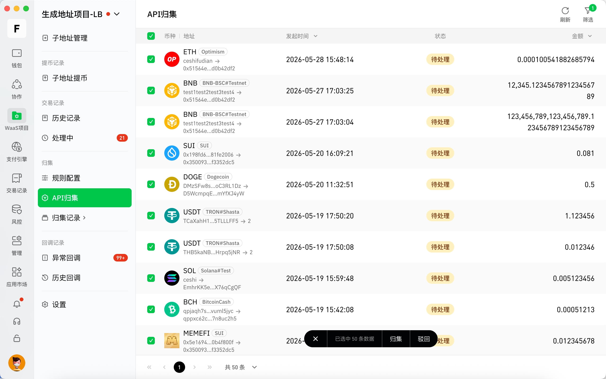

# 归集

归集用于将 WaaS 项目子地址中的资产，主动归集到指定的归集地址，便于统一管理资金余额、提升资金利用效率以及减少分散资产管理成本。当前支持以下三种归集方式：

* 手动归集
  * 通过创建归集规则后，手动发起归集，系统会根据规则自动筛选符合条件的子地址，并将地址内符合条件的资产，全部归集到指定接收地址。
* API归集
  * 通过 API 发起归集请求后，在 API 归集页面手动处理或开启自动化处理，可指定归集地址和金额，精确控制归集行为；
* 自动归集
  * 通过创建自动化规则后，系统自动发起归集，无需人工手动操作，系统会根据规则自动筛选符合条件的子地址，并将地址内符合条件的资产，全部归集到指定接收地址。

## **手动归集**

用户可提前配置归集规则，在需要时手动触发归集任务，系统会根据规则筛选符合条件的子地址进行归集。功能入口：WaaS 项目 → 归集 → 规则配置

### **创建归集规则**

点击页面「新增」按钮进入创建页面。

<figure><figcaption></figcaption></figure>

配置归集规则，包括规则名称、归集币种、归集金额、到账地址，归集金额支持以下四种模式：

* 不限：归集所有地址资金，如果地址余额小于等于最小发送金额，则不进行归集；
* 大于等于：仅归集余额大于等于指定金额的地址；
* 小于等于：仅归集余额小于等于指定金额的地址；
* 金额区间：仅归集余额在指定金额范围内的地址。

<figure><figcaption></figcaption></figure>

配置完成后，点击「确定」按钮进行Google Authenticator验证，验证通过则规则创建成功。

### **发起归集**

规则创建完成后，可在规则列表中点击「开始归集」按钮发起归集。

<figure><figcaption></figcaption></figure>

进入归集确认页面，系统将根据当前规则自动筛选符合条件的子地址，并显示预计可归集金额/笔数，确认后点击「确定」按钮。

<figure><figcaption></figcaption></figure>

输入交易密码后，点击「确定」按钮开始归集。

<figure><figcaption></figcaption></figure>

开始归集后，可在「任务记录」页面查看归集进度。

<figure><figcaption></figcaption></figure>

## **API归集**

业务系统调用API归集后，系统会生成待处理归集任务，并在API归集页面显示，在需要时可手动触发或自动化任务触发归集。功能入口：WaaS项目 → 归集 → API归集

### **发起API归集请求**

请前往 [开发者文档](https://developer-cn.cregis.com/api-reference/request-apis/address/address-balance-collect) 了解详细API归集请求调用方法。

### **手动处理API归集**

在 API 归集页面中，可批量选择多个归集请求同时进行处理（归集、驳回），如果是进行批量归集操作，请先筛选指定币种再进行操作，因为不同币种链上处理机制不同，所以系统不支持跨币种批量归集。

<figure><figcaption></figcaption></figure>

选择好要处理的归集请求后，点击「归集」按钮进入归集确认页面，确认并选择矿工费后，点击「确定」按钮。

<figure><figcaption></figcaption></figure>

输入交易密码后，点击「确定」按钮开始归集。

<figure><figcaption></figcaption></figure>

开始归集后，可点击API归集页面右下角的归集进度按钮，查看归集进度

<figure><figcaption></figcaption></figure>

### **自动处理API归集**

创建自动化任务后，系统将会根据规则自动处理符合条件的API归集请求，详情请查看下方自动归集了解。

## **自动归集**

用户可创建自动化任务，系统会根据规则自动触发并筛选符合条件的子地址进行归集，无需人工手动操作。了解自动化功能请前往 [自动归集/签名](https://support.cregis.com/cregis-wallet-guide/zh-cn/risk_management/automation) 。

## **归集矿工费规则说明**

为确保交易能够顺利上链，并兼顾不同区块链网络的费用模型差异，Cregis 针对不同网络，采用差异化的 Gas（矿工费 / 资源）扣除机制。归集过程中系统会自动检测Gas（矿工费 / 资源）是否充足 ，并自动进行充值，具体规则如下：

* Tron 网络采用 **资源模型（带宽 / 能量）**，而非传统意义上的 Gas 费，在 Tron 网络下发生交易时，Cregis 将按照以下顺序自动消耗资源：
  * 进行Tron 网络主币（TRX）归集
    * 优先消耗地址资源（带宽）：如果交易的发送方地址有足够的资源，将优先消耗地址资源；
    * 带宽不足时，将燃烧TRX抵扣资源（带宽）：资源不足时，系统将燃烧地址中的 TRX，将 TRX 转换为资源完成交易。
  * 进行Tron 网络代币（如USDT）归集
    * 优先消耗地址资源（带宽、能量）：如果交易的发送方地址有足够的资源，将优先消耗地址资源；
    * 资源不足时，由 Cregis 进行资源代付：Cregis 自动补充所需资源，确保交易可正常完成，代付的资源将从团队账户余额进行扣费；
    * 如以上方式仍无法满足交易需求：系统将燃烧地址中的 TRX，将 TRX 转换为资源完成交易。
* 其他网络币种归集
  * 优先使用地址矿工费：如果交易的发送方地址有足够的矿工费，可直接进行归集交易；
  * 如果地址矿工费不足：系统将自动从归集接收地址给被归集地址充值矿工费。

