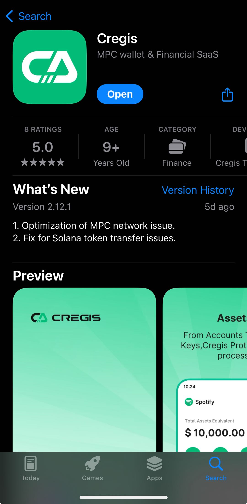

# Download and Installation

## PC

**Download and install the Cregis PC Client**

Visit the download link [https://www.cregis.com/download ](https://www.cregis.com/download), select the operating system to download the corresponding Cregis installation package, package size is about, Mac: 148M, Windows: 105M.

<figure><figcaption></figcaption></figure>

After downloading, double-click the installation package to install Cregis Client on the PC according to the instructions.

## Mobile

You can download and install Cregis via the app stores.

IOS : [https://apps.apple.com/hk/app/cregis/id6447176492](https://apps.apple.com/hk/app/cregis/id6447176492)

Android: [https://play.google.com/store/apps/details?id=com.cregis\&hl=en](https://play.google.com/store/apps/details?id=com.cregis\&hl=en)

<figure><figcaption></figcaption></figure>
