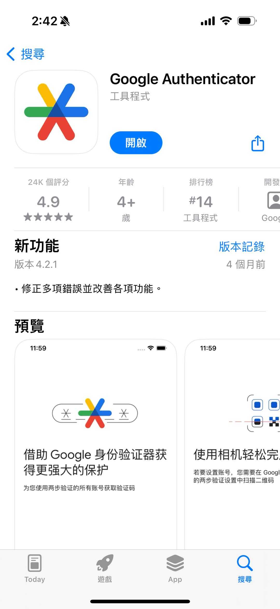

# Registration and Login

1. Register a Cregis account\
   After successful installation, open the Cregis application. The first time you open it, you will be prompted to "Create Account". Click the "Language" menu in the upper right corner to switch languages.

<figure><figcaption></figcaption></figure>

2. Enter the email address and account nickname used for registration, and check the terms of service and privacy agreement below. After filling out the information, you can click "enter" or the arrow icon to the next step.

<figure><figcaption></figcaption></figure>

3.  Login to your email and check the verification code. 

    <figure><figcaption></figcaption></figure>
4.  Bind Google verification\
    Download the <mark style="color:green;">**Official Google Authenticator**</mark> and log in with your own Google account to download and install it.\
    \
    <mark style="color:green;">**Please ensure that you download the official one rather than the fake one.**</mark>    \
    IOS download Link : [IOS Google Authenticator](https://apps.apple.com/hk/app/g2fa-for-google-authenticator/id6444865161?mt=12)    \
    Android download Link : [Android Google Authenticator](https://play.google.com/store/apps/details?id=com.google.android.apps.authenticator2) 

    Please open Google Authenticated PC -> Click  icon to add new key -> Choose the method you want to bind secret key -> add. Then go back to Cregis and click "Check code"

    <figure><figcaption></figcaption></figure>

\
5\. Bind Google verification, automatically bind after entering the 6-digit Google verification code.

<figure><figcaption></figcaption></figure>

6. Set transaction password\
   To log in to the Cregis system for the first time, you need to set up a trading password for your account. After entering the trading password with a combination of 8-16 letters and numbers, click OK. (Please keep the trading password safe.)

<figure><figcaption></figcaption></figure>

7. After entering the transaction password, please enter the Google authentication code again for security authentication. 

<figure><figcaption></figcaption></figure>

8. After Google recognized the code, the transaction password has been successfully set.

<figure><figcaption></figcaption></figure>

