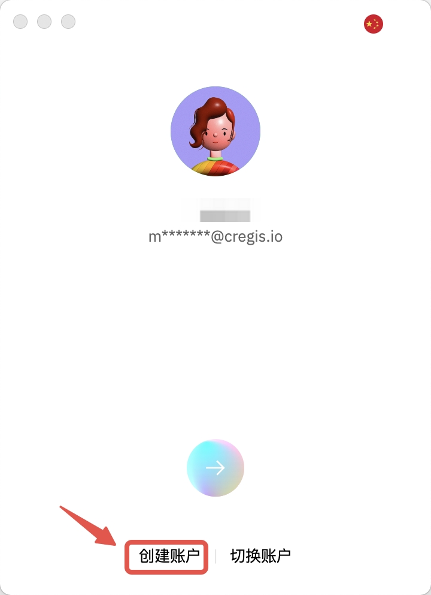
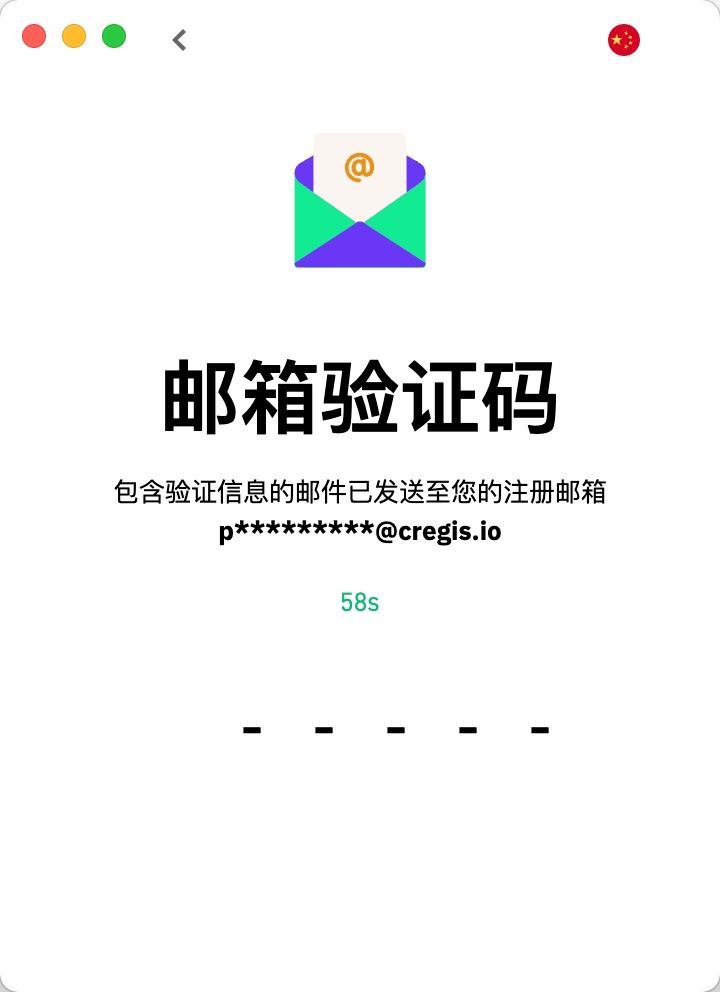

# 帐号注册及登录

1. 注册Cregis账户 \
   安装成功后，打开Cregis应用程序。首次打开时，系统会提示您“创建账户”。点击右上角的“语言”菜单可切换语言。 

<figure><figcaption></figcaption></figure>

1.  输入用于注册的电子邮件地址和账户昵称，并勾选下方的服务条款和隐私协议。填写完信息后，您可以点击“进入”或箭头图标进入下一步。 

    <figure><figcaption></figcaption></figure>
2. 登录您的电子邮件并检查验证码。
3.  绑定Google验证\
    下载官方的Google Authenticator，并使用您的Google账户登录以进行下载和安装。

    请确保您下载的是官方版本，而非假冒应用。\
    IOS下载链接：[IOS Google Authenticator](https://apps.apple.com/hk/app/google-authenticator/id388497605)\
    Android下载链接：[Android Google Authenticator](https://play.google.com/store/apps/details?id=com.google.android.apps.authenticator2\&pli=1) 

    <figure><figcaption></figcaption></figure>
4.  请打开Google验证器PC版 -> 点击图标以添加新密钥 -> 选择您想绑定密钥的方法 -> 添加。然后返回Cregis，点击「校验」。 

    <figure><figcaption></figcaption></figure>

5.  设置交易密码 \
    首次登录Cregis系统时，您需要为账户设置一个交易密码。请输入由8-16个字母和数字组成的交易密码，然后点击确认。（请妥善保管您的交易密码。） 

    <figure><figcaption></figcaption></figure>
6.  输入交易密码后，请再次输入Google验证码进行安全验证。 

    <figure><figcaption></figcaption></figure>
7.  Google验证成功后，交易密码已成功设置。 

    <figure><figcaption></figcaption></figure>
