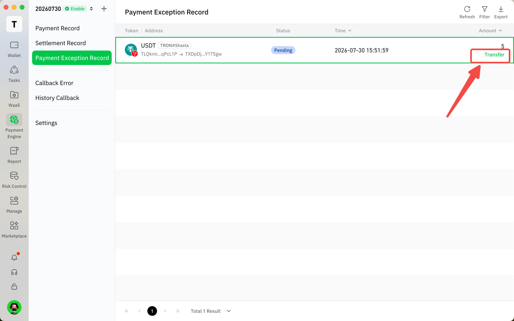

# View Order Related Records

## Order Record

1.  To view order records, you can check the "Payment Records" within the payment engine.

    <figure><figcaption></figcaption></figure>

2.  Click on a record to view order details.

    <figure><figcaption></figcaption></figure>

3.  Use the icon in the upper right corner to export order records.

    <figure><figcaption></figcaption></figure>

## Settlement Record

1.  To view settlement records, you can check the "Settlement Records" within the payment engine.

    <figure><figcaption></figcaption></figure>

2.  Click on a record to view settlement details.

    <figure><figcaption></figcaption></figure>

3.  Use the icon in the upper right corner to export settlement records.

    <figure><figcaption></figcaption></figure>

## Payment Exception Record

1.  If a payment occurs outside of the standard order logic, the exceptional payment can be viewed in the "Payment Exception Record" within the payment engine.

    <figure><figcaption></figcaption></figure>

2.  Click on a record to view payment exception details.

    <figure><figcaption></figcaption></figure>

3.  Use the icon in the upper right corner to export settlement records.

    <figure><figcaption></figcaption></figure>

4.  Merchants may self-transfer payment exceptions via the Cregis Portal. Click the Transfer button to initiate. 

    <figure><figcaption></figcaption></figure>

5.  Transfer Token Selection: You may select either your configured settlement currency (Settings → Payment & Settlement) or the same token on the same chain.

    <figure><figcaption></figcaption></figure>

6.  Receiver Address: If the configured settlement currency is selected, the receiver address is automatically populated using your configured settlement address. For any other token, you must manually enter the destination address.

    <figure><figcaption></figcaption></figure>

7.  Remarks: You may add optional notes regarding the transfer. These remarks are saved and can be reviewed later in the Payment Exception Details page (shown in Step 2).

    <figure><figcaption></figcaption></figure>

8.  Transaction Fee Rate: If the Cregis team has assigned a fee rate to your project, the rate will be the same across all currencies; otherwise, the default rate is 1%.\
    \
    Transaction Min Fee: If the transfer token matches your configured settlement currency, the minimum fee mirrors the standard rate shown in Settings → Payment & Settlement. If the Cregis team has waived the minimum transaction fee for your account, no minimum fee applies here either. Otherwise, the minimum fee is determined by the currency table below. For unlisted currencies, a 1 USD equivalent (calculated via real-time CoinMarketCap rates) applies. 

    <figure><figcaption></figcaption></figure>

<table data-search="false"><thead><tr><th width="496.5">Token</th><th>Minimum Transaction Fee</th></tr></thead><tbody><tr><td>USDT-TRC20, USDT-ERC20</td><td>1 USDT</td></tr><tr><td>USDT-BEP20, USDT-Solana, USDT-Polygon, USDT-Avalance-C, USDT- Arbitrum One</td><td>0.5 USDT</td></tr><tr><td>USDC-ERC20</td><td>1 USDC</td></tr><tr><td>USDC-Base, USDC-BEP20, USDC-Solana, USDC-Polygon, USDC-Avalance-C, USDC-Arbitrum One, USDC-Optimism</td><td>0.5 USDC</td></tr><tr><td>TRON</td><td>1 TRX</td></tr><tr><td>Solana</td><td>0.0002 SOL</td></tr><tr><td>BNB-BSC</td><td>0.0002 BNB</td></tr><tr><td>Ethereum, Base, Arbitrum One, Optimism</td><td>0.0002 ETH</td></tr><tr><td>Bitcoin</td><td>0.00001 BTC</td></tr></tbody></table>

Please note that:

* Transfer is only applicable if the payment exception is not AML-related. For AML-related, please contact Cregis support team.
* If the transaction fee is greater than or equal to the payment exception amount, the transfer will not be allowed.
* You may configure the transfer currency as your settlement currency prior to transfer to apply your standard minimum fee and fee rate.

