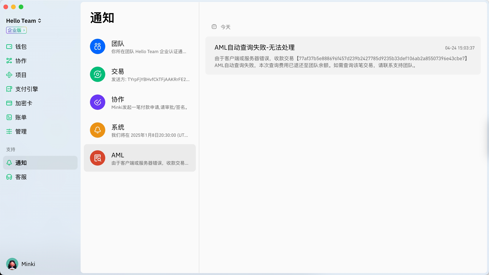

# AML查询功能

## 1. 什么是AML查询？&#x20;

Cregis AML是与知名加密风控服务供应商Elliptic合作推出的风险管理功能，帮助用户识别、控制和处置链上风险。Cregis AML目前可进行地址风险评估（KYA）和交易风险评估（KYT），提供手动查询和自动查询两项功能。用户可以根据业务需要选择合适的功能和方法，有效管理链上交易风险。

* Cregis AML功能仅对付费订阅用户开放。如需使用，请开通付费计划。
* Cregis AML功能的费用不包含在月费中，需根据用户使用次数单独收费，请保证账户余额充足。

请注意，本服务由Cregis合作方提供。在任何情况下，Cregis及合作方不对客户在使用服务过程中发现的实际或潜在的法律或监管违规行为负责。您应知悉交易存在风险，并基于自身判断，审慎进行交易。

## 2. 服务商介绍

Cregis AML目前有两家风控服务合作商，Elliptic和Regtank。不同服务商的风险评分方法、费用和网络支持情况均有不同，建议用户根据实际需要，选择合适的风控服务商。

### 2.1. Elliptic

Elliptic通过检测链上资金的来源及去向，评估资金与洗钱高风险和制裁相关钱包地址的关联情况，根据风险资金比例计算交易或地址的风险评分。换言之，Elliptic的评分与交易或地址的。Elliptic的基本查询费用为单笔2USD，不区分查询对象和方式，付费订阅用户可在此基础上享受一定折扣。\
Elliptic全链查询功能共支持49条区块链网络，所支持的网络列表如下：

| Algorand            | Aptos       | Arbitrum          | Avalanche   | Base        | Binance Chain |
| ------------------- | ----------- | ----------------- | ----------- | ----------- | ------------- |
| Binance Smart Chain | Bitcoin     | Bittensor         | Cardano     | Celo        | Codex         |
| Core Chain          | Cosmos      | Crypto.com        | Dogecoin    | dYdX        | Ethereum      |
| Ethereum Classic    | Filecoin    | Fantom            | Flare       | Gnosis      | HAQQ          |
| Hedera              | Injective   | Internet Computer | Linea       | Litecoin    | Mantra        |
| MobileCoin          | Near        | Nillion           | Optimism    | Polkadot    | Polygon       |
| Ripple              | Sei         | Solana            | Stellar     | Sui         | Tezos         |
| TON                 | Tron        | Unichain          | Worldcoin   | XDC         | Zilliqa       |
| zkSync              | 
 
 | 
 
       | 
 
 | 
 
 | 
 
   |

### 2.2. Regtank

Regtank的风险评估体系结合链上数据分析与风险标签系统，提供钱包、交易、VASP 的全面评估，呈现实体信息和风险标签，辅助识别资金来源与流向。Regtank的单笔查询费用为单笔0.3USD，不区分查询对象和方式，付费订阅用户可在此基础上享受一定折扣。Regtank支持以下18条区块链网络：

| Arbitrumone | Avalanche | Base     | Bitcoin  | Bitcoincash | Blast    |
| ----------- | --------- | -------- | -------- | ----------- | -------- |
| BSC         | Dash      | Dogecoin | Ethereum | Litecoin    | Optimism |
| Polygon     | Ripple    | Solana   | Tezos    | Ton         | Tron     |

## 3. 功能介绍

为满足用户在不同场景下的需求，Cregis AML目前提供手动查询和自动查询两类风险管理功能

### 3.1. 手动查询

* 手动查询帮助用户进行地址风险评估（KYA）和交易风险评估（KYT），用户可以发起对钱包地址或交易的AML查询，自主选择服务商，参考风险评估结果，采取相应风险管理措施。
* 进行手动KYA查询时，用户需要输入待评估的钱包地址和地址所在的网络。Cregis AML将识别地址所属的实体，还将从资金来源和去向两个维度对该地址所有资产展开筛查，识别资金相关联的地址和实体，并分析其风险类型和特征。在此基础上，测算目标地址资金来源和去向的风险评分，按照“最高风险原则”得到最终的地址风险评分。
* 进行手动KYT查询时，用户需要选择查询方向（收款或出款），并输入待评估交易的网络、收款地址和交易哈希。Cregis AML将按照用户所选方向，对收款交易的资金来源或出款交易的资金去向进行追溯，识别与该笔交易资金相关的风险实体及其风险特征，据此计算交易风险评分。

**操作步骤**

<mark style="color:green;">**在使用AML查询功能前，请确保您是订阅用户。有关订阅步骤可参考**</mark>[<mark style="color:blue;">**此页**</mark>](../accountmanagement/bill_and_payment/pricing_plan.md)<mark style="color:green;">**。**</mark>

前往AML查询页面并点击“新增查询”，或在交易详情页面点击地址旁的图标。

<figure><figcaption></figcaption></figure>

先选择查询类型，如查询交易则要输入方向、网络、收款地址、交易哈希及服务商。如查询地址则输入网络、地址及供应商，网络并输入您想查询的地址。

<figure><figcaption></figcaption></figure>

请注意不同的服务商收费及支持的网络都不一样，你可以点击服务商比较查看更多。

<figure><figcaption></figcaption></figure>

点击“查看”后，系统会显示温馨提示。

<figure><figcaption></figcaption></figure>

然后，您需要输入交易密码完成验证。

<figure><figcaption></figcaption></figure>

完成验证后，您可以查看查询结果。

<figure><figcaption></figcaption></figure>

你也可以在查询记录找到查询详情包括来源风险及去向风险评分

<figure><figcaption></figcaption></figure>

### 3.2. 自动查询

Cregis AML的自动查询功能可以根据用户预设的规则对API收款交易进行筛选，对用户希望重点关注的交易进行风险评估，并依据评估结果采取相应的风险控制措施。规则创建与管理需要在Cregis桌面端进行，查询结果可以在桌面端及手机端查看。要使用自动查询功能，用户必须首先创建查询规则：

* 设置查询的触发条件，包括需要进行交易监控的项目、币种和金额。用户可创建多条规则，但每个项目只能设置一条查询规则，且每条规则只能选择一个服务商。每条规则中可以对不同币种设置不同的风控触发金额。
* 根据业务需要和风险偏好自定义风险标准，在0到10.0之间选择适合的数值，当交易的风险评分达到或超过这一数值时，Cregis AML将判定该交易为危险交易。
* 选择风险警报接收人，Cregis AML识别危险交易后将向接收人发送风险警报。

完成规则设置并启用规则后，Cregis AML将对触发规则的收款交易进行交易风险评估（KYT）。评估完成后，Cregis AML将根据所触发规则设定的风险标准，判断交易是否属于危险交易。若收款地址/项目被禁用，在手动解禁前，Cregis AML将不会再筛查该地址/项目的任何交易。

识别到危险交易后，Cregis AML将禁用该收款地址，暂停该地址API回调和资金归集，并向用户指定的警报接收人发送风险警报。用户收到风险警报后，可查看查询详情以了解交易风险来源。如果认定风险在可接受范围内，用户可手动进行API回调和地址解禁。

**操作步骤**

自动查询主要的操作是设定好AML自动规则，可以先进入以下页面然后点击创建。

<figure><figcaption></figcaption></figure>

点击后可以开始创建规则

<figure><figcaption></figcaption></figure>

* 规则名称：为规则命名
* 项目：选择需要监控交易的项目，请注意每个项目只能创建一条规则
* 币种：选择币种及设置金额大于多少时触发自动AML查询

<figure><figcaption>
币种设定图示
</figcaption></figure>

* 服务商：选择你用来查询的服务商
* 风险分级标准：可设置0.0 (安全)-10.0(非常危险)之间，当风险分数大于你所设置的标准时便会定义为危险交易，发送警报通知及自动禁止该项目地址。
* 风险警报接收人：可设置负责接收风险警报的团队成员

设置完成后点击提交及进行身份验证以完成创建流程，创建成功后需启用该规则才可正式使用。

每次创建、编辑、启用及删除规则都会有记录，可在日志查看。

<figure><figcaption></figcaption></figure>

## 4. 查询结果说明

### 4.1. 地址查询（KYA）

手动查询的输出结果包括风险评分和评级、所属实体和标签及查询详情。

1. **风险评分和评级**

风险评分范围是0.0-10.0，评分越高，风险越大。0分表示风险极低，10.0分表示风险极高。由于不同风控服务商采取的评分方式不同，Cregis AML采用服务商建议的风险评级方式对查询结果进行划分。

请注意，以下评级方式是服务商基于一般性场景做出的评估和建议，可能无法适应用户的特定风控需求。建议用户根据风险评分及查询详情，结合自身实际情况和风控需求，对地址或交易的风险等级进行独立判断，以保证资金和运营安全。

Elliptic建议的风险评分和分级对应关系如下表：

| **评分区间**    | **风险分级** |
| ----------- | -------- |
| \[0,2.5)    | 低风险/安全   |
| \[2.5,7.5)  | 中风险/可疑   |
| \[7.5,10.0] | 高风险/危险   |

Regtank建议的风险评分和评级对应关系如下表：

| **评分区间**   | **风险评级** |
| ---------- | -------- |
| \[0,3.0]   | 安全       |
| (3.0,7.0]  | 可疑       |
| (7.0,10.0] | 危险       |

**由于标签分类和风险评分计算方法不同，使用Regtank进行风险评估时，相当一部分地址（特别是交易所地址和商用钱包地址）会被判定为可疑地址。从实际情况看，6分以下的地址一般风险较低。建议用户参考查询详情，根据自身风险管理需要做出判断。**

2. **地址所属实体和标签**

地址所属实体指的是拥有该地址的公司、组织、项目或其他实体的名称。实体标签是服务商对拥有该地址的实体进行的标记，通常可反映该地址或所属实体的类别或风险特征，如Exchange（交易所）、Bank（银行）、Mixing service（混币服务）等。

所属实体和实体标签可以方便用户对地址的风险状况进行更全面的评估和判断。Cregis AML使用合作伙伴的地址标签库对地址进行标记，Elliptic的实体标签列表参见附录B。当地址属于自托管钱包、个人钱包或所属实体信息未纳入信息库，则这两项显示为unknown。

3. **查询详情**

查询详情中包括两个部分，资金来源和资金去向。Cregis AML将分别从资金来源和去向两个维度，分别给出风险评分和风险关联对象。用户还可以查看每个风险关联对象的风险类型/实体类型、资金量和贡献比。

*   **来源/去向风险评分**

    来源或去向的风险评分范围同样是0.0-10.0，评分越高，风险越大。查询地址的整体风险评分等于来源和去向风险评分中较高的分数。
* **风险关联对象**\
  在资金来源维度下，风险关联对象是向目标地址转账的、被判定为存在风险的对象；在资金去向维度下，风险关联对象是接收目标地址转账的、被判定为存在风险的对象。风险关联对象一般是公司/组织/团队，如果无法确定该对象身份，则显示为“未知（Unknown）”。用户可查看风险关联对象的详情，包括：
  * 风险类型/实体类型\
    使用Elliptic进行查询时，仅显示高风险关联对象，风险类型即该对象所涉及风险的类型，如Scam（诈骗）、Thief（窃盗）等。Cregis AML使用Elliptic的地址标签库判断关联对象的风险类型，具体类型和描述参见附录A。\
    使用Regtank进行查询时，同时显示中风险和高风险的关联对象，实体类型即该对象所属实体的标签，如Decentralized Exchange（去中心化交易所）、 Service（服务商）等。Cregis AML使用Regtank的地址标签库判断关联对象的实体类型，具体类型和描述参见附录C。
  * 资金量\
    在资金来源维度下，资金量指从风险关联对象流入目标地址的资金量（美元计价）；在资金去向维度下，资金量指从目标地址流入风险关联对象的资金量（美元计价）。
  * 贡献比\
    指该风险关联对象的资金量在目标地址流入/流出的总资金量中所占的比例，单位为%。
  * 风险评分和评级（仅Regtank提供）\
    使用Regtank进行查询时，还将提供该风险关联对象的风险评分和评级，评分范围和评级方式参见前文。

### 4.2. 交易查询（KYT）

对触发自动查询的交易，Cregis AML将为用户提供风险评分和查询详情两类信息。

1. **风险评分**

风险评分的范围是0.0-10.0。风险评分与出款地址资金来源中风险资金的贡献比例直接相关，风险资金贡献比越大，风险评分越高，两者大致对应关系如下表：

| **风险评分**    | 0.0 | 1.0 | 2.5 | 5.0 | 7.5 | 10.0 |
| ----------- | --- | --- | --- | --- | --- | ---- |
| **风险资金贡献比** | ＜1% | 10% | 25% | 50% | 75% | ＞99% |

与Elliptic不同，Regtank使用的风险评分模型对资金进行溯源分析，沿资金来源路径向上追溯至6到10跳，逐个考察资金流经的每个地址节点的风险，对各节点风险进行加权计算，得到最终的交易风险评分。节点地址的风险越大、流经风险地址的资金越多，该交易风险评分越高。根据这一评分方法，风险评分与风险资金占比不存在明确的对应关系。从实际使用情况看，6分以下的交易一般可认为风险较低。\
Cregis建议用户根据实际风控需要，选择合适的供应商并设置适应业务需要的风险分级标准。

2. **查询详情**

显示所查询交易的出款地址的风险关联对象，即曾经向该出款地址转账的、被判定为存在风险的对象。用户可以具体查看每个风险关联对象的风险类型、资金量和贡献比。

* 风险类型\
  使用Elliptic进行查询时，仅显示高风险关联对象，风险类型即该对象所涉及风险的类型，如Scam（诈骗）、Thief（窃盗）等。Cregis AML使用Elliptic的地址标签库判断关联对象的风险类型，具体类型和描述参见附录A。\
  使用Regtank进行查询时，同时显示中风险和高风险的关联对象，实体类型即该对象所属实体的标签，如Decentralized Exchange（去中心化交易所）、 Service（服务商）等。Cregis AML使用Regtank的地址标签库判断关联对象的实体类型，具体类型和描述参见附录C。
* 资金量\
  指从风险关联对象流入这一出款地址的资金量（美元计价）。
* 贡献比\
  指该风险关联对象的资金量在目标地址流入的总资金量中所占的比例，单位为%。
*   风险评分和评级（仅Regtank提供）

    使用Regtank进行查询时，还将提供该风险关联对象的风险评分和评级，评分范围和评级方式参见前文。

## **5. 应用场景**

### 5.1. 交易前风控

交易前风控旨在交易执行前对风险进行识别、评估和控制，防止交易错误或恶意行为引起的异常交易，避免出现重大资金损失。在执行重要交易前，用户可以对收款地址进行手动查询，了解收款地址的风险曝露，作为收款地址风险状况的初步判断依据。如果收款地址风险评分较高，Cregis强烈建议用户终止与该地址的交易，以规避资金损失以及运营和法律监管的风险。如果收款地址的风险评分属于中风险区间，建议用户采取其他方式进一步核查收款方身份和收款地址，确保安全性后再执行交易。

### 5.2. 交易监控

交易监控是以自动化技术手段进行实时或近实时的交易筛查和检测，识别潜在风险或可疑行为，确保交易合规与资产安全。在加密交易中，风险资产入账可能导致收款地址风险曝露提高，是常见风险之一。对于收款频率高、资金来源存在不确定性的用户，Cregis AML的自动查询功能可以帮助实现收款交易的实时监控，及时发现潜在风险、隔离相关地址，避免风险扩散引起更大的损失。当一笔交易被认定为危险交易，Cregis建议用户及时查看和了解该交易风险状况。一般情况下，Cregis建议不再使用该交易的收款地址，避免风险外溢到其他钱包，影响用户正常交易。如果认定风险在可接受范围内，用户可手动启用收款地址

## 6. AML功能局限性说明

**Cregis AML无法覆盖所有风险因素**。\
Cregis AML使用Elliptic等加密风控服务商的风险数据库进行风险追踪，该数据库覆盖50个网络，包含超过64亿地址、交易记录及其风险信息。尽管如此，受限于数据库的有限性和更新滞后性，Cregis AML仍然不可能记录和标记所有存在风险的地址和资金流动，因而无法识别所有风险因素。用户应将Cregis AML的风险查询结果作为风险识别和控制的参考，而非唯一的、确定性的证据。

**Cregis AML的风险评估结果具有时效性**。\
Cregis AML采取基于历史行为的风险评估模型，当且仅当资金流经地址存在风险行为记录并且被标记时，才会认定风险存在。如果某一地址风险行为未被发现、或风险行为发生在风险评估之后，则相关风险无法体现在风险评估结果中。因此，Cregis AML的风险查询结果是在查询发生时、对查询对象已知风险行为的综合评价，不能用于预测查询对象未来的风险状况。如果用户在不同的时间对同一对象发起查询，查询结果可能出现差别。

## 7. FAQ

*   **为什么会出现查询失败的情况？这种情况如何处理？**\
    查询失败一般是由于团队余额不足或第三方服务器错误导致的，失败时系统亦会发通知给风险警报接收人。如果团队余额不足导致查询失败，用户可以在充值后重新进行地址查询，以了解目标地址风险状况。

    <figure><figcaption></figcaption></figure>
* **查询失败是否扣费？**\
  查询失败不会产生任何费用。
* **为什么我的手动查询结果页面中，风险评分和查询详情显示为空？**\
  这表示风险数据库中并未记录所查询地址的任何风险行为。这可能是因为所查询地址是新创建地址、还没有任何交易记录，也可能是因为所查询地址没有与风险地址进行资金交互的记录。基于交易历史，Cregis AML判定该地址为安全地址。但用户进行交易时仍应考虑其他方面的风险，如诈骗、钓鱼攻击等。
* **为什么我的自动查询显示查询结果为空？**\
  出现这种结果可能有以下原因：1）所查询交易的信息尚未纳入风险数据库；2）风险数据库中没有所查询交易资金来源相关的风险信息。对于第二种情况，一般可以认为资金来源风险较小，但无法完全排除存在风险的可能性。
* **为什么风险评分显示为0.0，但查询详情中仍然有风险关联实体信息？**\
  这表示所有风险关联对象与目标地址的资金交互总额小于目标地址资金总量的1%。由于涉及风险的资金占比极低，系统判定风险评分为0.0。
* **为什么查询详情中，风险关联对象的资金量显示为0.00，但贡献比大于0？**\
  这表示风险关联对象转入/转出的资金量小于0.01美元，但由于查询对象的总资金量小于100美元，涉及风险的资金占比高于0.01%，因此贡献比大于0。
* **自动查询结果为空时，该笔交易可以如何处理？**\
  对于查询结果为空的交易，用户可以在AML查询结果页面进行手动处理。由于个别情况下交易风险信息入库时间较长，用户可使用“重新查询”功能在1天后重查该笔交易，查看交易风险信息是否有更新。用户也可以在对该笔交易进行风险排查后，手动标记该交易的风险状况。如果标记为安全，Cregis将照常进行回调和资金归集；如果标记为危险，Cregis将禁用收款地址以隔离风险资金。
* **使用Regtank查询时，查询详情中“忽略小额”这一标签是什么含义？为什么这类地址风险评分为5分？**\
  Regtank使用资金溯源分析和节点风险聚合评估来计算风险评分。随着追溯层级的增加，节点地址对目标地址或交易的资金贡献比往往会逐渐减少。当某个节点地址的资金贡献比低于0.01%、且该地址不属于Regtank数据库中任何被标签的实体时，为节省算力，Regtank将不再对该地址进行风险评估，而将其归为“忽略小额”。查询详情中“忽略小额”的资金贡献比，实际上是所有此类地址的资金贡献比的综合。由于这类地址风险未知，Regtank将此类地址的风险评分认定为5分。

## 附录

### A. Elliptic-风险类别、描述和范例

| 风险类别                                      | 描述                                                                                  | 范例                                |
| ----------------------------------------- | ----------------------------------------------------------------------------------- | --------------------------------- |
| 犯罪组织Criminal Organisation                 | 由多人组成的、参与有组织犯罪的团体                                                                   | The Shadow Brokers                |
| 代币交换服务Coin Swap Service                   | 具有固定汇率的加密货币转换服务，通常不需要用户登录或任何KYC                                                     | 
 
                       |
| 信用卡数据供应商Credit Card Data Vendor           | 提供非法凭证和其他非法个人财务信息的在线卡片商店                                                            | 
JokerStash.store 
       |
| 暗网论坛Dark Forum                            | 仅限TOR访问的在线讨论论坛                                                                      | DNM Avengers                      |
| 儿童性虐待制品Child Sexual Abuse Material Vendor | 提供儿童性虐待图像以换取加密资产的供应商                                                                | 
 
                       |
| 暗网黑市-中心化Dark Market-Centralized           | 仅限TOR访问的市场，通过集中式基础设施销售非法商品和服务                                                       | Dream Market                      |
| 暗网黑市-去中心化Dark Market-Decentralized        | 仅限TOR访问的市场，通过分散的基础设施销售非法商品和服务                                                       | Wall Street Market                |
| 暗网服务Dark Service                          | 非法服务，包括黑客、钱包和网络托管服务                                                                 | PinPays                           |
| 暗网商店Dark Vendor Shop                      | 暗网黑市上仅可通过TOR访问的个人供应商，出售非法商品和服务                                                      | Euroarms                          |
| 勒索Extortion                               | 使用武力或威胁从个人或多人处获取资金                                                                  | Ashley Madison Extortion          |
| 极左/极右极端主义Far-Left/Far-Right Extremism     | 实体（a）被判犯有与极左/极右极端主义活动直接相关的罪行，或（b）已被多个合法来源识别和核实（有证据），长期煽动暴力、性侵犯或其他严重犯罪——左翼/右翼极端主义言论。 | 
 
                       |
| 高交易费High Transaction Fee                  | 涉及矿工的交易费用高于平均水平的交易，表明可能存在损失或犯罪活动                                                    | 
 
                       |
| 已知罪犯Known Criminal                        | 参与非法活动的已知个人。通常与犯罪组织有联系。                                                             | Ross Ulbricht and Carl Mark Force |
| 恶意软件Malware                               | 旨在损坏或禁用计算机和计算机系统的软件                                                                 | 
Trickbot 
               |
| OFAC制裁实体OFAC Sanctioned Entity            | 受美国财政部海外资产控制办公室（OFAC）制裁的实体                                                          | 
 
                       |
| 网络钓鱼Phishing                              | 一种欺诈形式，消息发送者试图诱骗接收者泄露重要的个人信息、转账或安装恶意软件，发件人通常会冒充合法组织代表                               | TRON Web Wallet Phishing          |
| 庞氏骗局Ponzi Scheme                          | 一种欺诈形式，通过从后来的投资者投资资金中向第一批投资者支付快速回报来培养对不存在的企业成功的信念                                   | 
 
                       |
| 勒索软件Ransomware                            | 一种来自加密病毒学的恶意软件，除非支付赎金，否则威胁要发布受害者的数据或永久阻止对其的访问                                       | WannaCry 2.0                      |
| 诈骗Scam                                    | 任何其他类型的欺诈活动                                                                         | Prodeum                           |
| 恐怖组织Terrorist Organization                | 参与恐怖主义或相关活动的组织                                                                      | ISIS                              |
| 窃盗Thief                                   | 被盗资金的接收者                                                                            | Stolen CoinSecure Funds           |

### B. Elliptic-实体标签列表

| 标签                                        | 描述                                                                                  | 标签                              | 描述                                                    |
| ----------------------------------------- | ----------------------------------------------------------------------------------- | ------------------------------- | ----------------------------------------------------- |
| ATM自动提款机                                  | 可以用法定货币出售或购买加密资产的自动柜员机                                                              | Forum论坛                         | 在线讨论论坛                                                |
| Authentication验证                          | 允许用户在访问特定网站时无需输入登录凭证即可证明其唯一身份的服务，从而提高安全性                                            | Gambling赌博                      | 赌博服务                                                  |
| Bitcoin Faucet比特币水龙头                      | 免费赠送比特币、或以比特币形式来奖励用户完成任务的网站                                                         | Hardware Wallet硬件钱包             | 用于存储加密资产的物理硬件钱包                                       |
| Bridge跨链桥                                 | 用于将资产从一个区块链转移到另一个区块链的合约或服务                                                          | High Transaction Fee高交易费        | 涉及矿工的交易费用高于平均水平的交易，表明可能存在损失或犯罪活动                      |
| Broker经济商                                 | 代表客户参与买卖加密资产的实体，但没有订单簿                                                              | Hosting托管                       | 网站托管服务                                                |
| Charity慈善机构                               | 接受比特币捐赠的非营利或慈善组织                                                                    | Investment Syndicate投资集团        | 集团投资提供商，如加密资产风险运营商或多层次营销计划                            |
| Child Sexual Abuse Material Vendor儿童性虐待制品 | 提供儿童性虐待图像以换取加密资产的供应商                                                                | Known Criminal已知罪犯              | 参与非法活动的已知个人。通常与犯罪组织有联系                                |
| Coin Swap Service代币交换服务                   | 具有固定汇率的加密货币转换服务，通常不需要用户登录或任何KYC                                                     | Law Enforcement执法部门             | 已知的执法机构                                               |
| Credit Card Data Vendor信用卡数据供应商           | 提供非法凭证和其他非法个人财务信息的在线卡片商店                                                            | Layer 2                         | 基于Layer 1区块链构建的区块链扩展解决方案                              |
| Crypto Exchange加密货币交易所                    | 客户只能交易加密资产以换取其他加密资产的交易所                                                             | Malware恶意软件                     | 旨在损坏或禁用计算机和计算机系统的软件                                   |
| Criminal Organization犯罪组织                 | 由多人组成的、参与有组织犯罪的团体                                                                   | Marijuana Vendor Shop大麻供应商店     | 在受监管司法管辖区注册的大麻药房                                      |
| Dark Forum暗网论坛                            | 仅限TOR访问的在线讨论论坛                                                                      | Merchant商家                      | 线上合法卖家或商店                                             |
| Dark Market-Centralized暗网黑市-中心化           | 仅限TOR访问的市场，通过集中式基础设施销售非法商品和服务                                                       | Microtransaction Service微交易服务   | 促进微交易的网站，如自由职业、生成加密资产的网络插件                            |
| Dark Market-Decentralized暗网黑市-去中心化        | 仅限TOR访问的市场，通过分散的基础设施销售非法商品和服务                                                       | Mine挖矿                          | 作为挖掘/验证过程的一部分，新铸造的加密资产                                |
| Dark Service暗网服务                          | 非法服务，包括黑客、钱包和网络托管服务                                                                 | Miner矿工                         | 挖矿和生成新加密资产的服务                                         |
| Dark Vendor Shop暗网商店                      | 暗网黑市上仅可通过TOR访问的个人供应商，出售非法商品和服务                                                      | Misc Service杂项服务                | 各种未分类的服务、供应商或组织                                       |
| Data数据                                    | 为最终用户提供数据的供应商                                                                       | Mixer加密货币混币器                    | 用于私密或是洗钱目的的、允许加密资产混合或模糊处理以使资金匿名的服务                    |
| DeFi去中心化金融                                | 去中心化金融平台                                                                            | News新闻                          | 在线新闻发布服务                                              |
| Decentralized Exchange去中心化交易所             | 一种去中心化服务，提供加密货币到加密货币的交换服务                                                           | NFT MarketpalceNFT平台            | 让创作者能够向用户出售NFT的市场                                     |
| Entertainment娱乐                           | 提供串流媒体、电视、电影和其它娱乐服务的供应商                                                             | OFAC Sanctioned EntityOFAC制裁实体  | 受美国财政部海外资产控制办公室（OFAC）制裁的实体                            |
| Escrow第三方托管                               | 为两方之间的交易提供托管服务的供应商                                                                  | Outsourcing Provider外包服务提供商     | 促进自由职业机会的网站                                           |
| Exchange交易所                               | 提供法币到加密货币、加密货币到加密货币交换服务的中心化服务商                                                      | Payment Service Provdier支付服务提供商 | 接受多种支付方式的在线支付服务提供商                                    |
| Extortion勒索                               | 使用武力或威胁从个人或多人处获取资金                                                                  | Peer to Peer Exchange点对点交易所     | 个人买家和卖家可以互相交换加密货币以换取其他资产的平台                           |
| 极左/极右极端主义Far-Left/Far-Right Extremism     | 实体（a）被判犯有与极左/极右极端主义活动直接相关的罪行，或（b）已被多个合法来源识别和核实（有证据），长期煽动暴力、性侵犯或其他严重犯罪——左翼/右翼极端主义言论。 | Phishing网络钓鱼                    | 一种欺诈形式，消息发送者试图诱骗接收者泄露重要的个人信息、转账或安装恶意软件，发件人通常会冒充合法组织代表 |
| Financial Service金融服务                     | 提供贷款、债券和衍生产品等金融服务的金融服务组织                                                            | Research Chemicals研究化学品         | 仅供实验室使用的散装化学品零售商                                      |
| Political Campaign政治运动                    | 政治运动或组织                                                                             | Scam诈骗                          | 任何其他类型的欺诈活动                                           |
| Ponzi Scheme庞氏骗局                          | 一种欺诈形式，通过从后来的投资者投资资金中向第一批投资者支付快速回报来培养对不存在的企业成功的信念                                   | Shielded屏蔽                      | 屏蔽地址使用加密技术来隐藏起地址和金额等链上信息                              |
| Privacy Wallet隐私钱包                        | 提供帮助用户避免区块链去匿名化功能的加密钱包                                                              | Software Wallet软件钱包             | 用于存储加密资产的无形软件钱包                                       |
| Ransomware勒索软件                            | 一种来自加密病毒学的恶意软件，除非支付赎金，否则威胁要发布受害者的数据或永久阻止对其的访问                                       | Terrorist Organization恐怖组织      | 参与恐怖主义或相关活动的组织                                        |
| Reported Loss遗失、损失通报                      | 由于破坏或分叉造成的损失                                                                        | User用户                          | 论坛或社交媒体用户                                             |
| Thief窃盗                                   | 被盗资金的接收者                                                                            | Validator区块链验证者                 | 负责执行区块链上交易的节点                                         |
| Token代币                                   | 特定资产或实用程序的代表                                                                        | Venture Capital风险投资机构           | 与被认为具有高增长潜力的初创公司、早期公司和新兴公司合作的风险投资组织                   |
| Token Sale代币销售                            | 与代币或其他加密资产的推出相关的众筹、预售或其他销售                                                          | VPN VendorVPN供应商                | 提供虚拟专用网络（VPN）服务的供应商                                   |
| Trading Platform交易平台                      | 提供交易所软件和服务的提供商，但不运营交易所                                                              | 
 
                     | 
 
                                           |

### C. Regtank-实体标签列表

| **标签**                                | **描述**                             | **标签**                                 | **描述**                                |
| ------------------------------------- | ---------------------------------- | -------------------------------------- | ------------------------------------- |
| 交易所Exchange                           | 加密货币交易所                            | 钱包Wallet                               | 特定钱包，如广告ICO或公司钱包                      |
| 捐赠Donations                           | 项目、公司或非营利性协会用于筹集资金的地址              | 去中心化服务Decentralized Servie             | 非交易所的去中心化加密货币平台，如DeFi平台、智能合约等         |
| 矿池Mining Pool                         | 一组联合矿工使用的地址                        | 去中心化交易所Decentralized Exchange          | 去中心化交易所                               |
| 云挖矿Cloud Mining                       | 用于挖矿具有远程算力的地址                      | 封闭式交易所Closed Exchange                  | 不对外交易所                                |
| 代币Token                               | 代表以太坊的ERC20标准或其他区块链等效标准的智能合约地址     | 可疑Suspicious                           | 与一些尚未证实或尚未采取法律行动的诈骗报告有关的地址            |
| 服务商Service                            | 属于中心化加密货币平台的非交易所实体，如支付处理器、借贷平台、商店等 | 混币服务Mixing Service                     | 帮助用户与其他用户资金进行混合的中心化平台                 |
| 空投Airdrop                             | 用于向其他钱包分发免费加密货币或代币的地址              | 诈骗Scam                                 | 诈骗中使用的地址                              |
| 首次代币发行ICO                             | 用于为新的加密货币项目筹集资金的地址                 | 黑客攻击Hack                               | 用于攻击或利用加密货币平台并导致被攻击或被利用的平台资金损失的地址     |
| 赌博Gambling                            | 加密赌场使用的地址                          | 钓鱼攻击Phishing                           | 通过伪装成可信赖实体来窃取私钥等敏感数据并导致被窃取者资金损失       |
| 暗网Darkweb                             | 与暗网活动相关的地址和实体，如暗网市场、被盗资金等          | 社区已识别诈骗Community Reported Scam         | 用户在在线论坛或社区报告的诈骗地址，但尚未取得官方确认           |
| 受制裁清单Sanction List                    | 已被OFAC（美国海外资产控制办公室）列入经济制裁名单的地址     | 进行中的法律诉讼Ongoing Legal Action           | 涉及诉讼、案件仍在审理中的地址                       |
| 恐怖主义Terrorism                         | 与恐怖活动有关的地址或实体                      | 跨链桥协议Cross-chain Bridge Protocol       | 利用智能合约技术在不同的区块链之间交换不同加密货币的实体，包括托管钱包地址 |
| 虐待儿童Child Abuse                       | 与虐待儿童有关的地址                         | 未用支出Unspent Output                     | 只存在于输出计分中的类型                          |
| 区块奖励Block Reward                      | 矿工成功开采新加密货币时收到的奖励                  | 支付渠道Payment Channel                    | 为使用闪电网络而开放的支付通道                       |
| 忽略小额Ignored Small Amounts             | 指金额较小而被算法忽略、未进行风险溯源的部分             | 未知来源剥离链Peeling Chain of Unknown Origin | 来源地址未知的剥离链                            |
| 未知（超出最大查询深度）Maximum Exploration Depth | 
算法探索达到极限，未找到任何实体名称并停止 
   | 大额交易Large Transaction                  | 
交易有超过200个输入/输出，建议仔细查看交易 
    |
| 混币模式Mixing Pattern                    | 去中心化隐私功能，让用户快速高效地与其他用户的资金进行混合      | 二次代币创建Secondary Coin Creation          | 创建新的ERC20代币的行为类型                      |
| 二次代币移除Secondary Coin Removal          | 销毁新ERC20代币的行为类型                    | 银行Bank                                 | 属于银行的地址                               |
