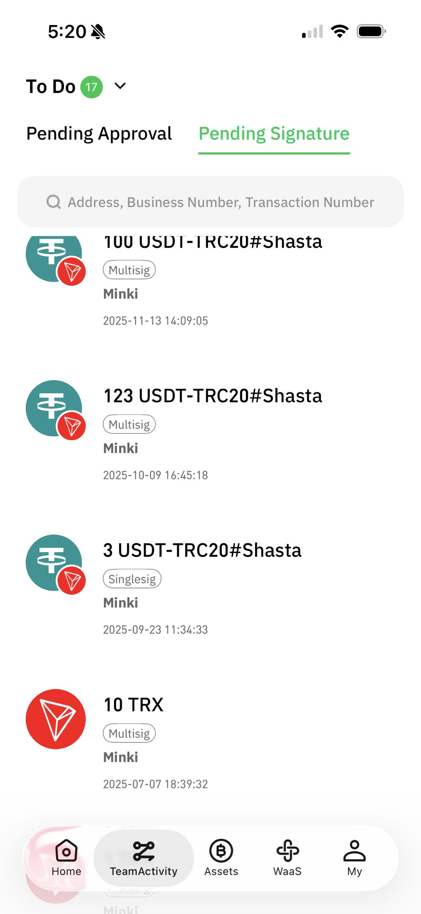
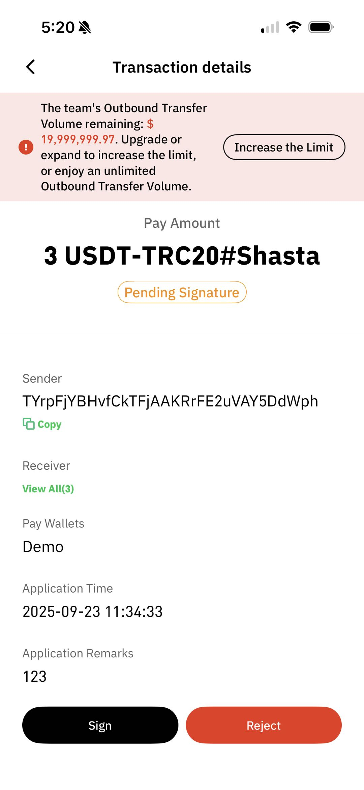
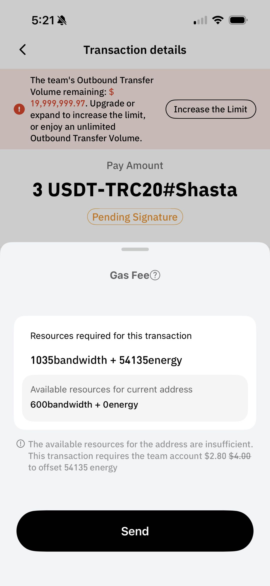
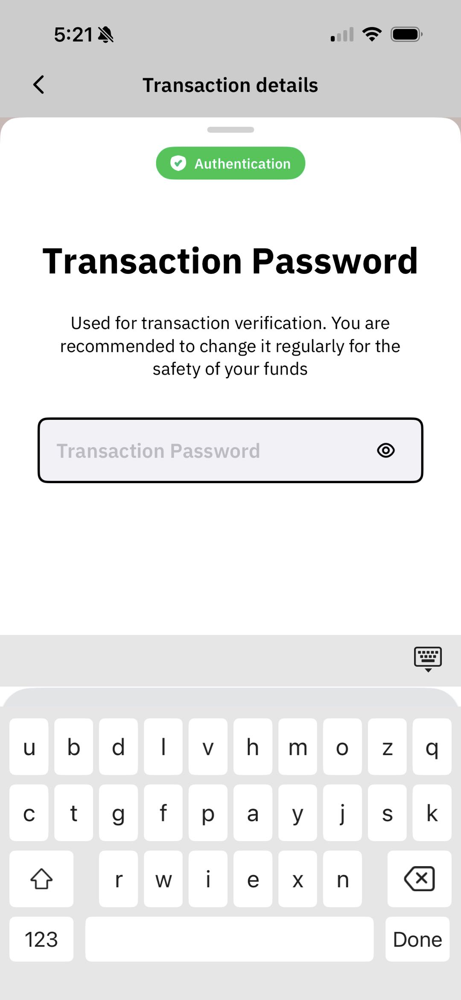
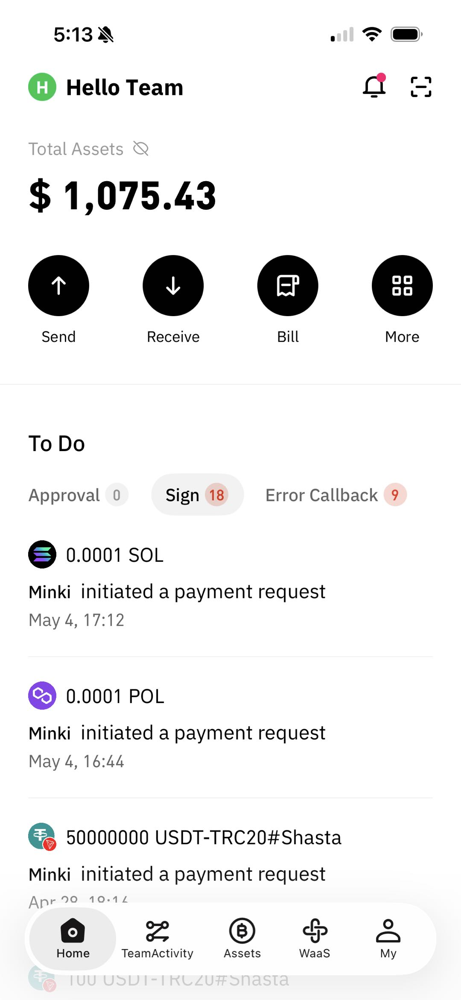
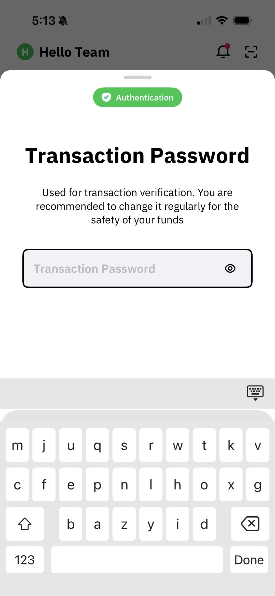
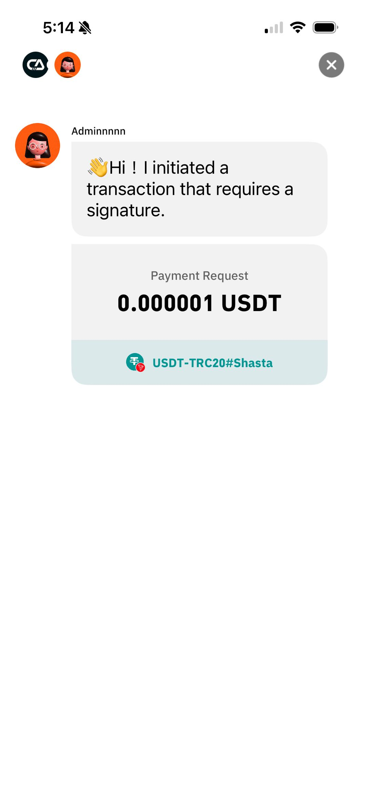
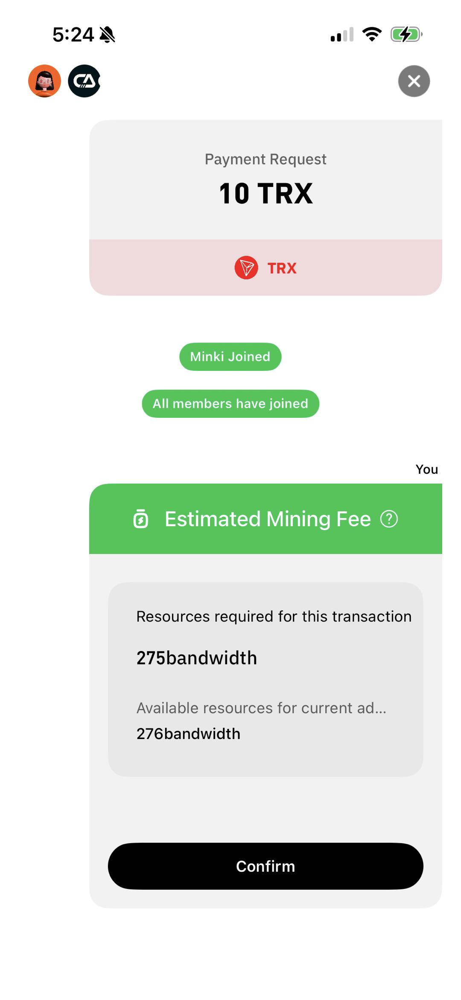

# Transaction Signing

## **Single‑Signature Wallet Transaction Signing**

### **Cregis Desktop**

You can find your signature requests in **Tasks**.

<figure><figcaption></figcaption></figure>

Click on a request to view the payment request details, and use the icons at the bottom to approve or reject the operation.

<figure><figcaption></figcaption></figure>

After clicking, you will need to verify your transaction password.

<figure><figcaption></figcaption></figure>

Once verification is complete, the required **Gas Fee** will be shown. After confirming, you can send it to successfully complete the signing.

<figure><figcaption></figcaption></figure> <figure><figcaption></figcaption></figure>

### **Cregis Mobile**

You can see pending signature items from the Home Page's To-Do section or from **Tasks**. Click on an item to view the transaction details. After confirming the signature, the estimated **Gas Fee** will be displayed.

<figure><figcaption></figcaption></figure> <figure><figcaption></figcaption></figure> <figure><figcaption></figcaption></figure>

After clicking Send, you need to complete the transaction password verification. The signing is then successfully completed.

<figure><figcaption></figcaption></figure>

## **Multi-Signature Wallet Transaction Signing**

### **Cregis Desktop**

You can find your signature requests in **Tasks**.

<figure><figcaption></figcaption></figure>

Click on a request to view the payment request details, and use the icons at the bottom to approve or reject the operation.

<figure><figcaption></figcaption></figure>

Then, you need to verify your transaction password.

<figure><figcaption></figcaption></figure>

After confirmation, wait for other multi-signature wallet members to join. Please note that all signers of the multi-signature wallet must be online simultaneously to sign. When the number of multi-signature signers reaches the minimum signing threshold, the required **Gas Fee** for this transaction will be displayed, and the signature initiator will confirm the signature.

<figure><figcaption></figcaption></figure> <figure><figcaption></figcaption></figure>

A pop-up message will appear after a successful signature.

<figure><figcaption></figcaption></figure>

### **Cregis Mobile App**

You can see pending signature items from the Home Page's To-Do section or from **Tasks**. Click on an item to view the transaction details. After confirming the signature, you will need to verify the transaction password.

<figure><figcaption></figcaption></figure> <figure><figcaption></figcaption></figure> <figure><figcaption></figcaption></figure>

Once verification is complete, you will enter the multi‑signature process. **If you are the initiator**, you can see which members have joined.\
When the number of joined multi‑signature signers reaches the minimum signing threshold, the signature initiator will see the estimated Gas Fee and can confirm it.

<figure><figcaption></figcaption></figure> <figure><figcaption></figcaption></figure>

 
