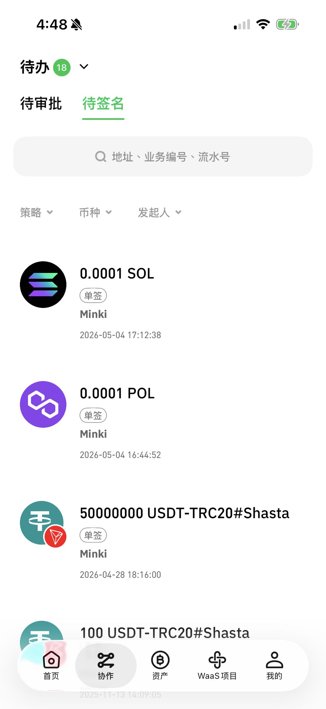
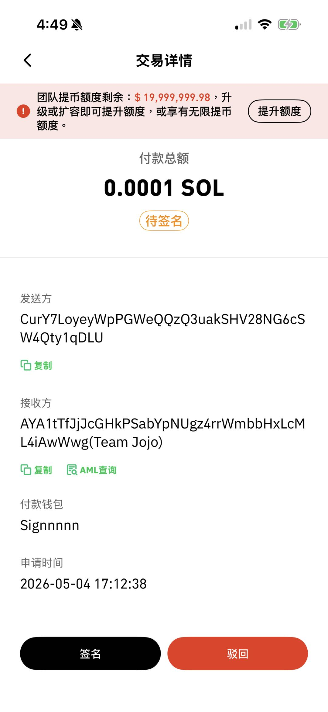
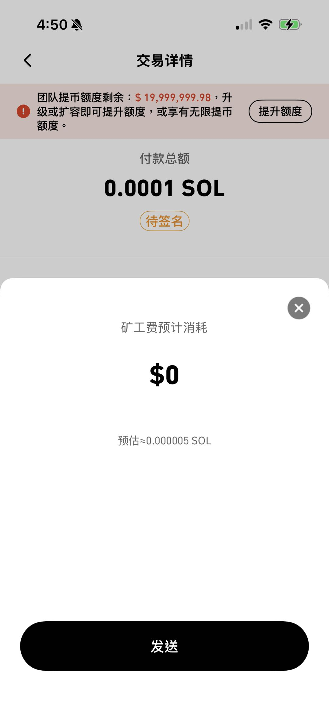
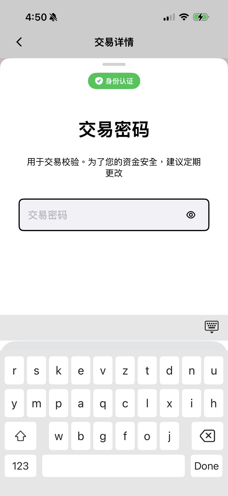
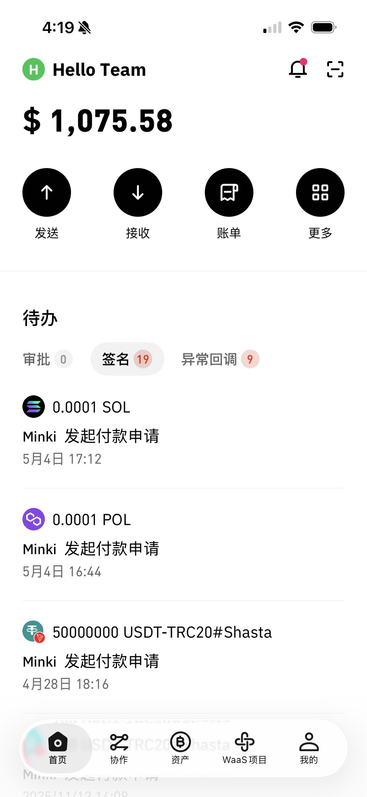
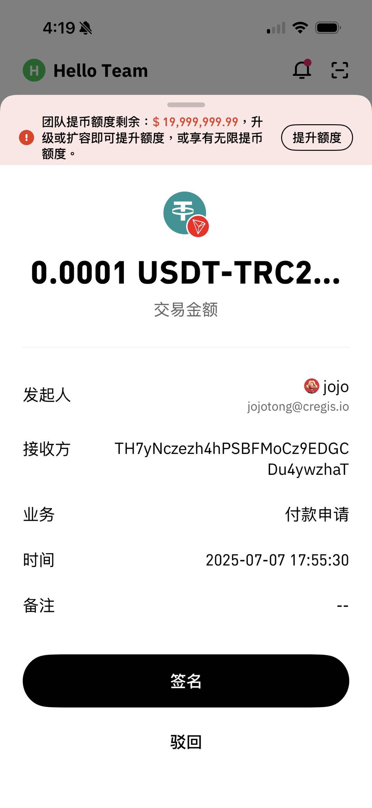
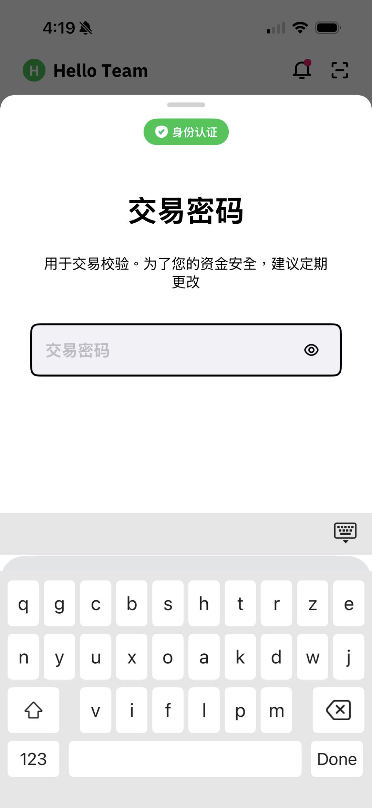
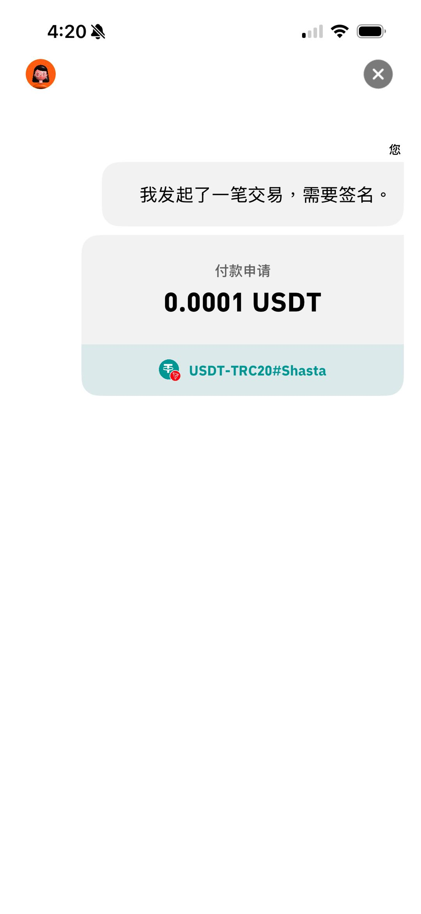
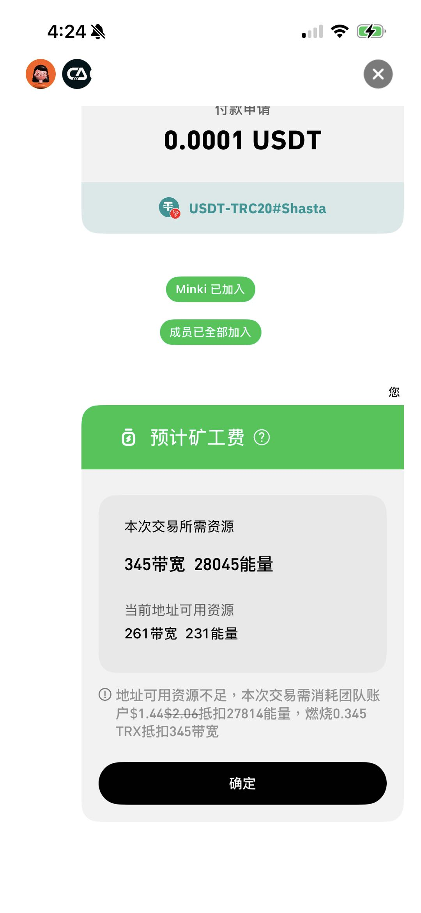
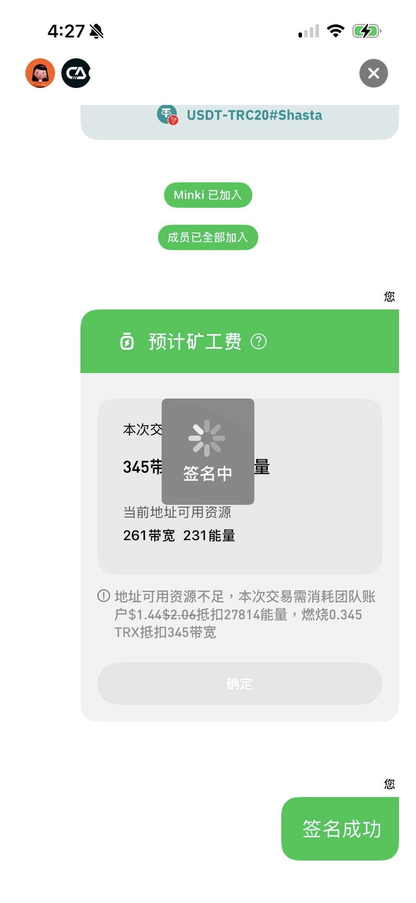

# 交易签名

## 单签钱包交易签名

### Cregis PC客户端

您可以在协作中找到您的签名请求。

<figure><figcaption></figcaption></figure>

点击请求可以查看付款请求详情，并使用底部的图标进行批准或拒绝操作。

<figure><figcaption></figcaption></figure>

点击后需进行交易密码验证

<figure><figcaption></figcaption></figure>

验证完成后可以看到所需的矿工费，确认后发送即可成功签名。

<figure><figcaption></figcaption></figure> <figure><figcaption></figcaption></figure>

### Cregis手机端

您可以从首页待办页面或协作看到待签名的项目，点击后可看到该交易的详情，确认签名后可以看到矿工费预估费用。

<figure><figcaption></figcaption></figure> <figure><figcaption></figcaption></figure> <figure><figcaption></figcaption></figure>

点击发送后需完成交易密码验证则签名成功。

<figure><figcaption></figcaption></figure>

## 多签钱包交易签名

### Cregis PC客户端

您可以在协作中找到您的签名请求。

<figure><figcaption></figcaption></figure>

点击请求可以查看付款请求详情，并使用底部的图标进行批准或拒绝操作。

<figure><figcaption></figcaption></figure>

然后需要进行交易密码验证

<figure><figcaption></figcaption></figure>

确定后等待其他多签钱包成员加入，注意多签钱包的签名人必须同时上线才可以进行签名。加入的多签签名人数达至最低签名门槛时便会展示本次交易所需的矿工费，由签名发起人进行签名确认。

<figure><figcaption></figcaption></figure>

签名成功后会弹出信息

<figure><figcaption></figcaption></figure>

### Cregis手机端

您可以从首页待办页面或协作看到待签名的项目，点击后可看到该交易的详情，确认签名后需进行交易密码验证。

<figure><figcaption></figcaption></figure> <figure><figcaption></figcaption></figure> <figure><figcaption></figcaption></figure>

验证完成后会进入多签环节，这里可以看到哪些成员已加入，当加入的多签签名人数达至最低签名门槛时，便会有预计矿工费，由签名发起人进行签名确认。

<figure><figcaption></figcaption></figure> <figure><figcaption></figcaption></figure> <figure><figcaption></figcaption></figure>

