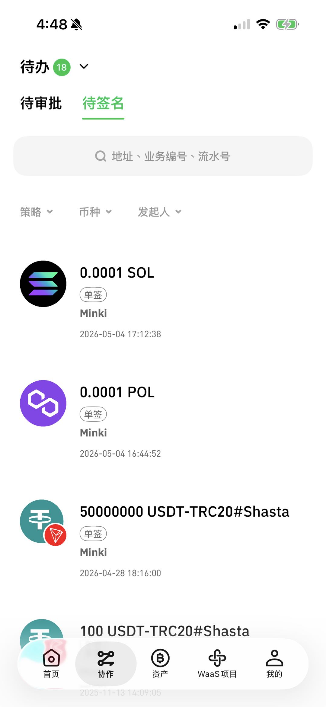
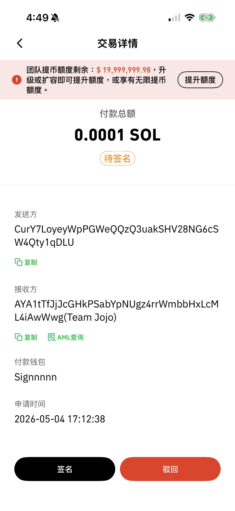
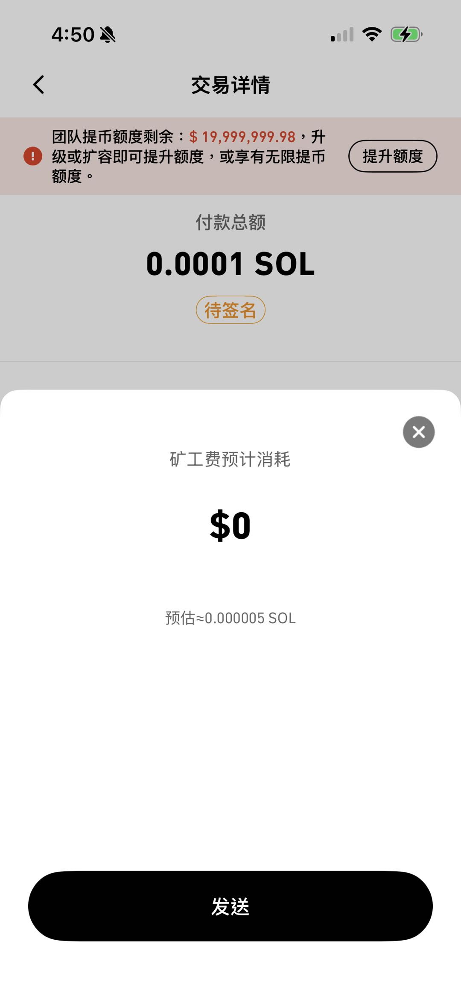
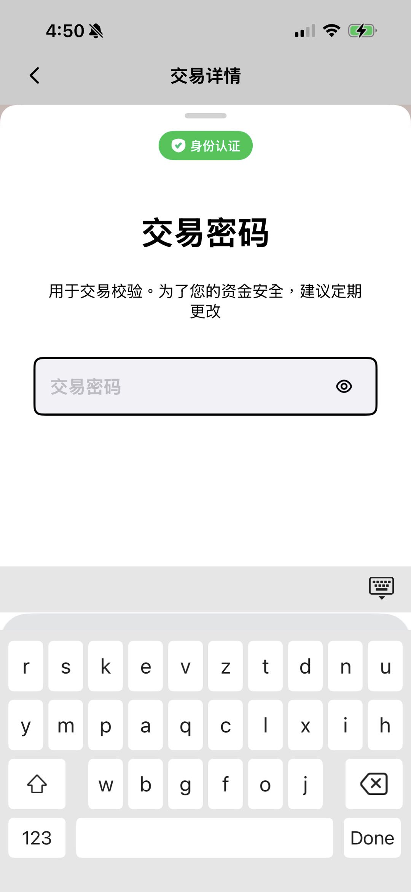
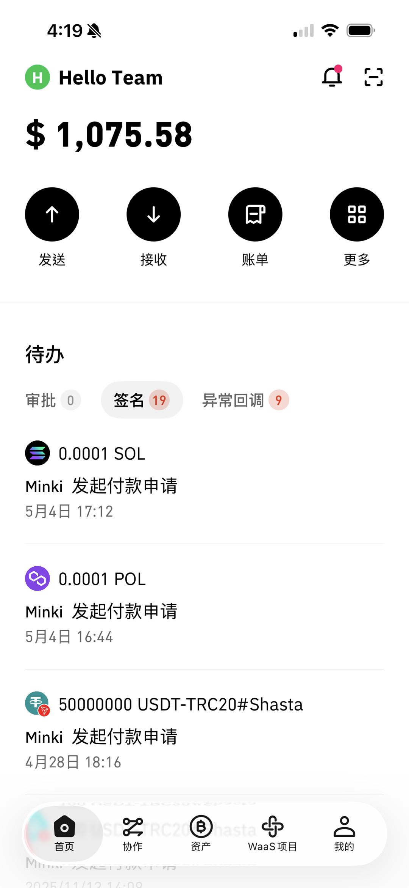
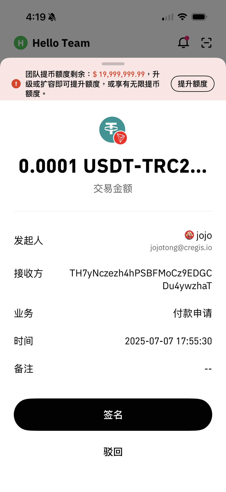
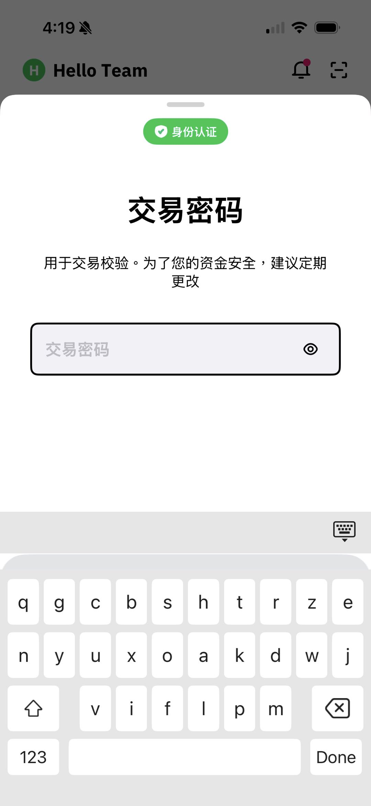
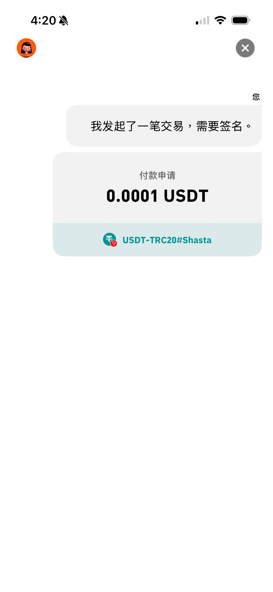
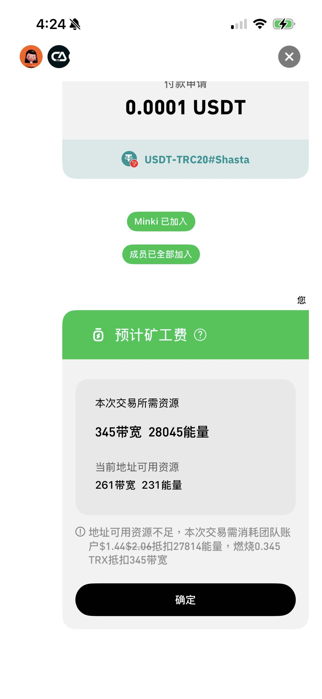
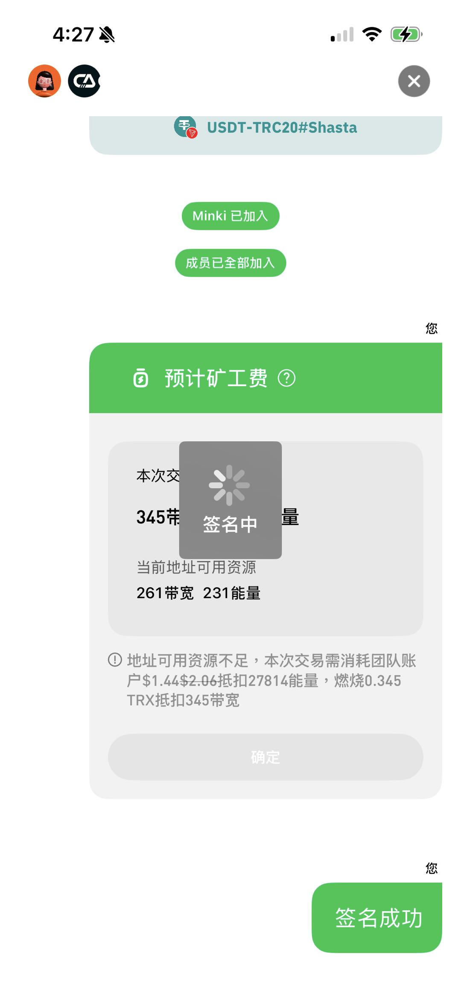

# 交易签名

## 签名

当交易完成必要的审批流程后，会进入签名阶段。符合签名条件且当前账号具有签名操作权限时，交易会进入协作 > 待签名，签名人可对交易进行签名或驳回。Cregis 支持单笔签名和批量签名，帮助团队高效处理待签名交易。签名完成后，可以在协作 > 已签名中查看已经处理的签名记录。

**重要提示**

* 如果交易的接收方地址为黑名单地址，该交易只能驳回，不允许签名。
* 批量签名单次仅支持处理相同币种的交易，不支持多币种混合签名。
* 批量签名仅支持单签钱包发起的单笔发送交易和 API 发起的交易。
* 多签钱包发起的交易、Swap 应用发起的交易以及批量发送交易，暂不支持批量签名，需要逐笔处理。

## **单笔签名**

由于单签钱包和多签钱包的签名机制不同，单笔签名需要根据交易的出款钱包类型进行处理。

### 单签钱包交易签名

#### Cregis PC客户端

对于由单签钱包发起的交易，只需一人就可以对交易执行签名。进入协作 > 待签名，找到需要处理的交易，点击交易右侧的「处理」。

<figure><figcaption></figcaption></figure>

进入签名详情后，可以查看该笔交易的详细信息，确认交易信息后，可以根据实际情况选择：

**签名**：确认授权该交易执行。\
**驳回**：拒绝该交易，不再继续签名。

如果接收方为黑名单地址，则只能选择驳回，无法签名。

<figure><figcaption></figcaption></figure>

点击「签名」后，弹出矿工费弹窗，确认矿工费后，点击「确定」。

<figure><figcaption></figcaption></figure>

系统会要求进行身份验证，输入交易密码并点击「确定」。

<figure><figcaption></figcaption></figure>

身份验证通过后，进入交易签名页面，签名成功后，系统自动将交易广播上链，并提示操作成功。

<figure><figcaption></figcaption></figure>

**多签钱包交易签名**

对于多签钱包的交易需要满足钱包配置的签名门限，因此与单签钱包的处理方式不同。进入协作 > 待签名后，选择需要处理的多签钱包交易，点击「处理」。

<figure><figcaption></figcaption></figure>

进入签名详情后，可以查看该笔交易的详细信息，确认交易信息后，可以根据实际情况选择：

**签名**：确认授权该交易执行，需其他签名人参与。\
**驳回**：拒绝该交易，不再继续签名。

如果接收方为黑名单地址，则只能选择驳回，无法签名。

<figure><figcaption></figcaption></figure>

点击「签名」后，系统会要求进行身份验证，输入交易密码并点击「确定」。

<figure><figcaption></figcaption></figure>

身份验证通过后，进入等待页面，需等待钱包其他成员加入，并且满足签名门限后，才能完成签名。

<figure><figcaption></figcaption></figure>

发起交易签名请求后，钱包的其他在线成员将会收到邀请通知，点击「多签邀请」。

<figure><figcaption></figcaption></figure>

确认交易信息后，点击「加入」。

<figure><figcaption></figcaption></figure>

系统会要求进行身份验证，输入交易密码并点击「确定」。

<figure><figcaption></figcaption></figure>

当参与成员达到签名门限要求，发起人点击「确定」。

<figure><figcaption></figcaption></figure>

弹出矿工费弹窗，确认矿工费后，点击「确定」。

<figure><figcaption></figcaption></figure>

进入交易签名页面，签名成功后，系统自动将交易广播上链，并提示操作成功。

<figure><figcaption></figcaption></figure>

#### Cregis手机端

您可以从首页待办页面或协作看到待签名的项目，点击后可看到该交易的详情，确认签名后可以看到矿工费预估费用。

<figure><figcaption></figcaption></figure> <figure><figcaption></figcaption></figure> <figure><figcaption></figcaption></figure>

点击发送后需完成交易密码验证则签名成功。

<figure><figcaption></figcaption></figure>

### 多签钱包交易签名

#### Cregis PC客户端

对于多签钱包的交易需要满足钱包配置的签名门限，因此与单签钱包的处理方式不同。进入协作 > 待签名后，选择需要处理的多签钱包交易，点击「处理」。

<figure><figcaption></figcaption></figure>

进入签名详情后，可以查看该笔交易的详细信息，确认交易信息后，可以根据实际情况选择：

**签名**：确认授权该交易执行，需其他签名人参与。\
**驳回**：拒绝该交易，不再继续签名。

如果接收方为黑名单地址，则只能选择驳回，无法签名。

<figure><figcaption></figcaption></figure>

点击「签名」后，系统会要求进行身份验证，输入交易密码并点击「确定」。

<figure><figcaption></figcaption></figure>

身份验证通过后，进入等待页面，需等待钱包其他成员加入，并且满足签名门限后，才能完成签名。

<figure><figcaption></figcaption></figure>

发起交易签名请求后，钱包的其他在线成员将会收到邀请通知，点击「多签邀请」。

<figure><figcaption></figcaption></figure>

确认交易信息后，点击「加入」。

<figure><figcaption></figcaption></figure>

系统会要求进行身份验证，输入交易密码并点击「确定」。

<figure><figcaption></figcaption></figure>

当参与成员达到签名门限要求，发起人点击「确定」。

<figure><figcaption></figcaption></figure>

弹出矿工费弹窗，确认矿工费后，点击「确定」。

<figure><figcaption></figcaption></figure>

进入交易签名页面，签名成功后，系统自动将交易广播上链，并提示操作成功。

<figure><figcaption></figcaption></figure>

#### Cregis手机端

您可以从首页待办页面或协作看到待签名的项目，点击后可看到该交易的详情，确认签名后需进行交易密码验证。

<figure><figcaption></figcaption></figure> <figure><figcaption></figcaption></figure> <figure><figcaption></figcaption></figure>

验证完成后会进入多签环节。**如果您是发起人**，可以在这里看到哪些成员已加入。\
当加入的多签签名人数达到最低签名门槛时，签名发起人即可看到预估矿工费，并由发起人进行确认。

<figure><figcaption></figcaption></figure> <figure><figcaption></figcaption></figure> <figure><figcaption></figcaption></figure>

## **批量签名**

当待签名交易较多时，可以使用批量签名一次处理多笔交易，提高签名效率。进入协作 > 待签名，点击右上角的「批处理」

<figure><figcaption></figcaption></figure>

选择要进行批量签名的币种，点击「查看」。

<figure><figcaption></figcaption></figure>

勾选需要处理的交易，选择交易后，可以根据实际情况选择：

**签名**：确认授权该交易执行。\
**驳回**：拒绝该交易，不再继续签名。

<figure><figcaption></figcaption></figure>

点击「签名」后，系统显示本次批量签名包含的交易统计，点击「确定」。

<figure><figcaption></figcaption></figure>

点击「确定」后，弹出矿工费弹窗，确认矿工费后，点击「确定」。

<figure><figcaption></figcaption></figure>

系统会要求进行身份验证，输入交易密码并点击「确定」。

<figure><figcaption></figcaption></figure>

身份验证通过后，系统执行批量签名。

<figure><figcaption></figcaption></figure>
