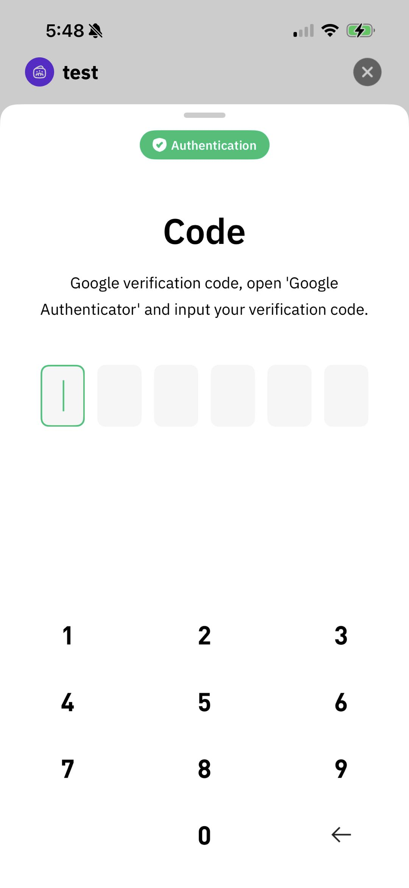

# Delete a Shard

You can delete the key shard in your device for safety concerns. If you cannot find the shard, you can reset it by any device.

**Cregis Desktop**

You can click the "delete" button under shard management and then click "confirm".

<figure><figcaption></figcaption></figure>

<figure><figcaption></figcaption></figure>

Shard will be deleted after you finish the verification.

<figure><figcaption></figcaption></figure>

**Cregis Mobile**

You can find the delete button below

<figure><figcaption></figcaption></figure>

After verifiction, the shard would be deleted successfully.

<figure><figcaption></figcaption></figure>
