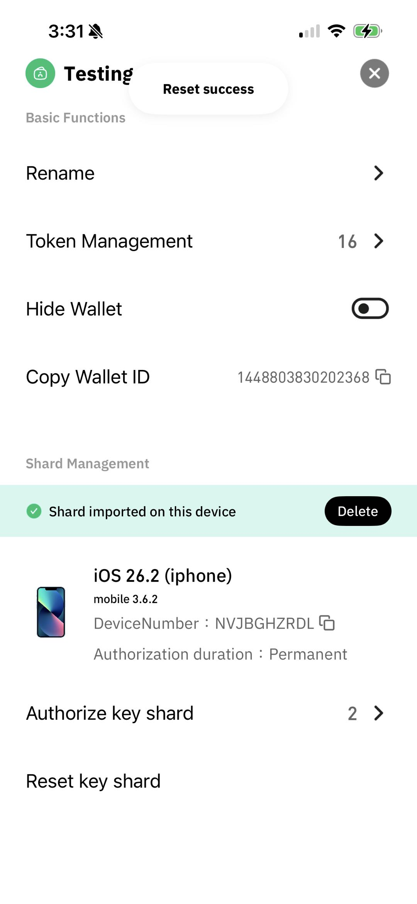
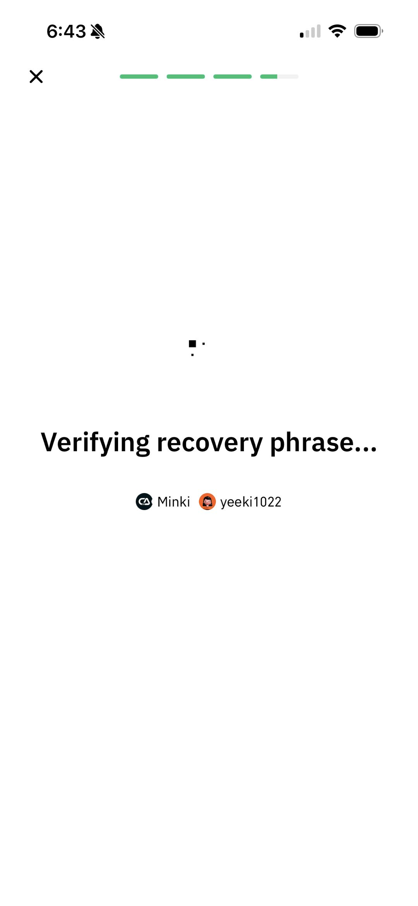

# Shard Reset

Resetting shards will invalidate all previous shards, and only the device used for the reset will generate new shards. Resetting shards requires the participation of all wallet creators, and the number of shards must meet the signing threshold. After shard reset, multisig wallets will generate a new recovery phrase, while single-signature wallets will continue to use the old recovery phrase.

## Single-signature wallet

### Cregis Desktop

Click the upper-right corner to enter the Wallet Info page.

<figure><figcaption></figcaption></figure>

Select the Reset function under Shard Management.

<figure><figcaption></figcaption></figure>

Enter the wallet's recovery phrase to reset shards.

<figure><figcaption></figcaption></figure>

After entering the correct phrase, an identity verification window will appear. Complete verification to finalize the shard reset.

### Cregis Mobile

<figure><figcaption></figcaption></figure>

<figure><figcaption></figcaption></figure>

<figure><figcaption></figcaption></figure>

## Multisig Wallet

Multisig wallets support two reset methods:

1. **Using Recovery Phrases to Reset Shards:** Regenerate new shards using the original recovery phrases.
2. **Using Shards to Reset Both Shards and Recovery Phrases:** Generate completely new recovery phrases and new shards using the existing shards.

<table><thead><tr><th width="213.29296875">Reset Method</th><th width="285.9453125">Use Case</th><th width="317.63671875">Reset Requirements</th><th>Are Old Shards Valid After Reset?</th><th width="320.40625">Are Recovery Phrases Valid After Reset?</th></tr></thead><tbody><tr><td><strong>Reset Shards Only</strong></td><td>When any wallet co-creator's shard device is damaged or lost.</td><td>All wallet co-creators participate and import their recovery phrases.</td><td>Invalid</td><td>Recovery phrases remain unchanged.</td></tr><tr><td><strong>Reset Both Shards &#x26; Recovery Phrases</strong></td><td>When any co-creator has lost their recovery phrases.</td><td>All wallet co-creators participate, and the number of devices holding shards meets the signing threshold.</td><td>Invalid</td><td>New recovery phrases are generated, but the old ones remain valid. Please note.</td></tr></tbody></table>

Resetting a multisig wallet generates new recovery phrases, with variations depending on wallet type:

*   Legacy wallets (non-TON/SUI support):

    Single recovery phrase set; reset regenerates one set.
*   TON/SUI-compatible wallets:

    Requires a device with existing shards for reset.

    Generates two new recovery phrase sets for future recovery use.
*   Newly created wallets (default two phrase sets):

    Reset produces two fresh recovery phrase sets.

**Note: Both old and new recovery phrases remain valid for wallet access and asset management. Store all phrases securely.**

### Cregis Desktop

Enter the Wallet Info page via the upper-right menu.

<figure><figcaption></figcaption></figure>

Click Reset.

<figure><figcaption></figcaption></figure>

Clicking will open a reset window. You can choose to reset using either the recovery phrases or the shards. Refer to the above introduction for details on each method.

<figure><figcaption></figcaption></figure>

A reset window appears— you need to wait for other members to come online.\
Note: Other members need to switch their page to the current team to be recognized as online.

<figure><figcaption></figcaption></figure>

#### **Reset Using Recovery Phrases**

Selecting this method will bring you to a waiting screen. **Note:** You must wait for **all** wallet co-creators to come online, and they must have switched to the current team to be considered online.&#x20;

<figure><figcaption></figcaption></figure>

Once everyone is online, the initiator can send invitations, which other co-creators can accept on their devices.&#x20;

<figure><figcaption></figcaption></figure>

After all co-creators accept, the initiator's screen will show "Ready," and the reset process can begin.&#x20;

<figure><figcaption></figcaption></figure>

You will then enter the recovery phrases. **Note:** Wallets that support adding TON and SUI chains have two sets of recovery phrases, while earlier created wallets only have one set.&#x20;

<figure><figcaption></figcaption></figure>

After entering your recovery phrases, wait for all co-creators to complete their input.&#x20;

<figure><figcaption></figcaption></figure>

Once all members have finished, the "Ready" prompt will appear, allowing the initiator to start recovery phrase verification and the reset. **Important:** If **any** co-creator's recovery phrase verification fails, the entire process must be re-verified.&#x20;

<figure><figcaption></figcaption></figure>

After successful verification, new shards will be generated on the current device. All previously authorized old shards will become invalid and require re-authorization if needed.

<figure><figcaption></figcaption></figure>

#### **Reset Using Shards**

Selecting this method will bring you to a waiting screen. **Note:** You must wait for **all** wallet co-creators to come online, and they must have switched to the current team to be considered online.&#x20;

<figure><figcaption></figcaption></figure>

Once everyone is online, the initiator can send invitations.&#x20;

<figure><figcaption></figcaption></figure>

Clicking "Send Invitation" requires transaction password authentication.&#x20;

<figure><figcaption></figcaption></figure>

After verification, wait for other wallet co-creators to join. Other co-creators also need to verify their transaction password when joining. **Note:** A sufficient number of members must ultimately sign; it is recommended to join using a device that holds a shard.&#x20;

<figure><figcaption></figcaption></figure>

After all co-creators join, the screen will show "Ready" and display the shard status of the currently joined member devices. When everyone has joined and the number of shards meets the decision-making threshold, the initiator can start the reset.&#x20;

<figure><figcaption></figcaption></figure>

The system will first reset the shards and then **generate new recovery phrases**.&#x20;

<figure><figcaption></figcaption></figure>

**Please ensure your environment is secure.** Click "I Understand" to begin backing up the new recovery phrases.&#x20;

<figure><figcaption></figcaption></figure>

<figure><figcaption></figcaption></figure>

After backup, you need to verify the recovery phrases.&#x20;

<figure><figcaption></figcaption></figure>

Once backup is complete, wait for other members to finish.&#x20;

<figure><figcaption></figcaption></figure>

When all members are done, the system will display a security reminder. **Please note: The old recovery phrases remain valid and can still be used to recover wallet assets.** Click "Confirm" to complete the shard reset process.

<figure><figcaption></figcaption></figure>

### Cregis Mobile

You can find the shard reset entry from the following location, then select your reset method.

<figure><figcaption></figcaption></figure>

#### **Reset Using Recovery Phrase**

After selecting this method, you will enter a waiting screen. **Please note:** You must wait for all wallet creators to come online. All creators must switch to the current team to be considered online. Once everyone is online, you can send invitations. Other creators can then accept the invitations on their own devices. After all creators have accepted, the initiator's screen will show "Ready", and the reset process can begin.

<figure><figcaption></figcaption></figure>

After starting, you will proceed to enter the recovery phrase(s). **Important:** Wallets that support adding TON and SUI chains will have **two sets** of recovery phrases, while earlier created wallets may only have one.

<figure><figcaption></figcaption></figure>

<figure><figcaption></figcaption></figure>

After completing your recovery phrase entry, wait for all other creators to finish. Once all members have entered their phrases, the screen will display "Ready". The initiator can then begin verifying the phrases and proceed with the reset.

<figure><figcaption></figcaption></figure>

**Note:** If **any** creator's recovery phrase fails verification, the entire process must restart. Upon successful reset, the following screen will appear.

<figure><figcaption></figcaption></figure>

#### **Reset Using Shards**

After selecting this method, you will enter a waiting screen. **Please note:** You must wait for all wallet creators to come online. All creators must switch to the current team to be considered online. Once everyone is online, you can send an invitation. Clicking "Send Invitation" will require transaction password authentication.

<figure><figcaption></figcaption></figure>

After verification, wait for the other wallet creators to join. **Important:** When other creators join, they must also authenticate with their transaction password. Please ensure that enough members join to meet the signature threshold for your decision model. It is recommended to use devices that contain shards when joining.

<figure><figcaption></figcaption></figure>

After all creators have joined, the screen will show "Ready" and display the shard status of the currently joined members' devices. When everyone has joined and the number of shards meets the decision model requirements, the initiator can begin the reset. Upon starting, the system will reset the shards and generate a new recovery phrase. **Ensure your environment is secure.** After clicking "Acknowledge", you can begin backing up the new recovery phrase.

<figure><figcaption></figcaption></figure>

After backing it up, you must verify the recovery phrase.

<figure><figcaption></figcaption></figure>

<figure><figcaption></figcaption></figure>

After completing the backup, wait for all other members to finish. Once all members are done, the system will display a security reminder. **Please note:** The old recovery phrase remains valid and can still be used to recover wallet assets.

<figure><figcaption></figcaption></figure>

