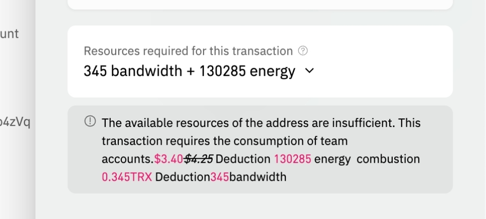

# Tron Energy Mode

Tron Energy Mode is a resource management mechanism in the Tron blockchain that allows users to reduce or eliminate transaction fees by obtaining Energy and Bandwidth. Cregis offers an enhanced Tron Energy Mode, helping users save an average of 30% in transaction fees by providing cost-effective access to these resources. Each time a Tron transaction is sent, if the address lacks sufficient available resources, the transaction will proceed using energy mode.

## Pricing of Cregis Tron Energy

Energy Fee = Energy X Price (420 SUN) / 10^6&#x20;

Bandwidth Fee = Bandwidth X Price (1000 SUN) / 10^6

## Use Tron Energy in Cregis

Tron Energy Mode is activated automatically when a user has a tron transaction to proceed. There are 3 ways to use Tron energy in Cregis.

1. Burn the Tron Energy in your address When you have energy in your address, the system will prioritize using the energy available in your address.
2.  Spend your account balance to purchase the Tron energy. If there is no energy in your address, the system will check your account USD balance. If your account has sufficient USD to cover the energy fee for this transaction, the system will automatically calculate the required amount in USD for you.\
    Please be reminded that account balance can only apply to Team Account. 

    <figure><figcaption></figcaption></figure>

    After sent, you can view the purchase record in your "Account fees".
3. Spend TRX to purchase the Tron energy If there is no energy and no USD in your account balance, you will need to spend TRX to purchase Tron energy. The system will help you the calculate the required TRX automatically.\
    

