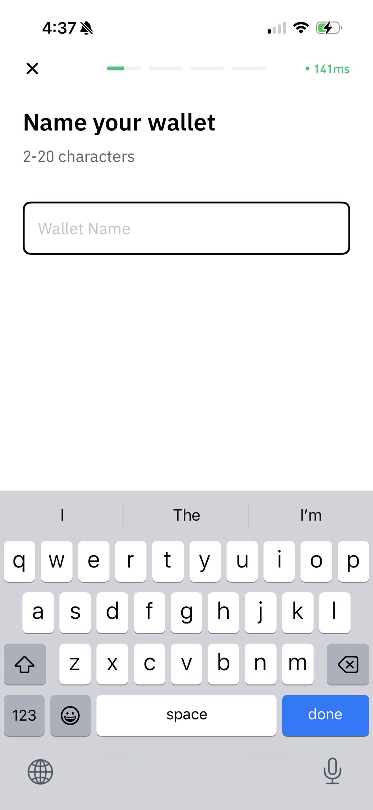
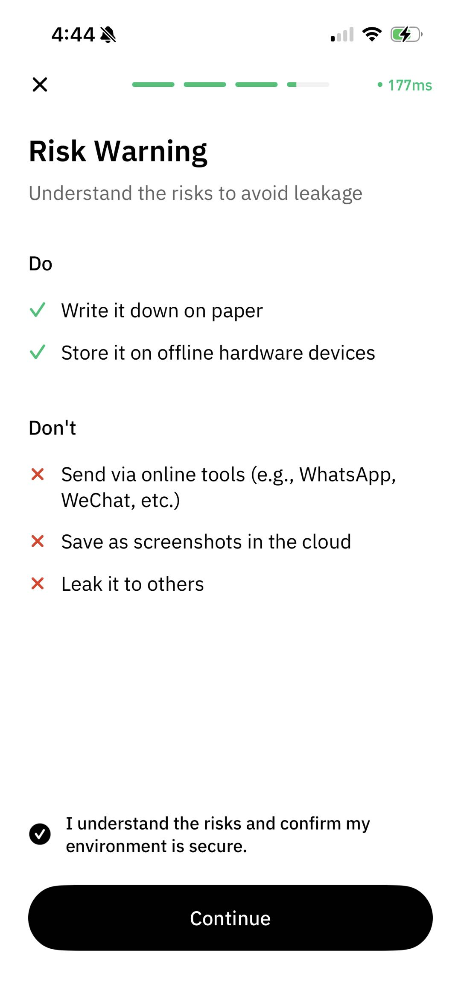

# Create a Wallet

## Cregis Desktop

To create a wallet, please navigate to the Wallet page from the left sidebar.

You may click the "+" icon to add a new wallet.

<figure><figcaption></figcaption></figure>

You can choose to create either a **Single-signature Wallet** or **Multi-signature Wallet**. Learn more about their differences [here](./).

<figure><figcaption></figcaption></figure>

### **Single-sig Wallet** 

A single-signature (single-sig) wallet is a type of cryptocurrency wallet that requires only one private key to authorize transactions.

1.  Enter the wallet name and click "Continue" to proceed to the next step. 

    <figure><figcaption></figcaption></figure>
2.  Carefully read the recovery phrase risk warning. Proceed only after confirming your understanding.

    <figure><figcaption></figcaption></figure>
3.  The system will generate 12 recovery phrases. Please accurately write them down on paper and store them securely. These phrases represent ownership of your wallet assets—they are extremely important and must be safeguarded.\
    Cregis system will not record the recovery phrase for users. After completing the recovery phrase in private recording, click "Backup Successfully" to proceed to the next step. 

    <figure><figcaption></figcaption></figure>
4.  Based on your previous records, select the recovery phrase in the corresponding position to confirm that you have recorded the recovery phrase. 

    <figure><figcaption></figcaption></figure>
5.  After answering the correct phrases, you need to complete the authentication by transaction password. 

    <figure><figcaption></figcaption></figure>

    <figure><figcaption></figcaption></figure>
6. After completing identity verification, the system will generate your wallet and automatically add mainstream cryptocurrencies.

### **Multi-sig Wallet** 

A multi-signature (multisig) wallet requires approval from multiple private keys for transactions, offering enhanced security over single-key wallets. All participants must be online during creation.

1.  Set a name for the multisig wallet. 

    <figure><figcaption></figcaption></figure>
2.  Select online participants from your current team (ensure their devices are connected). 

    <figure><figcaption></figcaption></figure>
3.  After selecting participants, set the approval threshold below. The threshold determines how many signatures are required to access wallet funds. Once set, click "Confirm" to send invitations. For example, you may select 3 participants but only require 2 signatures for approval.\
    Note: The required number of approvals cannot exceed the total participants. Also, ensure all participants remain online to complete wallet creation. 

    <figure><figcaption></figcaption></figure>

    <figure><figcaption></figcaption></figure>
4.  After confirmation, invitations will be sent. The creator will enter a waiting page and must wait for participants to join. Do not close this pop-up window during the process, or wallet creation will fail. 

    <figure><figcaption></figcaption></figure>

    Invited members will see a notification in their wallet page. Click to accept and join the creation process. 

    <figure><figcaption></figcaption></figure>
5.  After all participants have joined, click the "Start" button.

    <figure><figcaption></figcaption></figure>
6.  The process will begin with shard generation, followed by a recovery phrase risk warning. Read carefully and confirm to proceed. 

    <figure><figcaption>
 
</figcaption></figure>

    <figure><figcaption></figcaption></figure>
7.  The multisig wallet has two sets of recovery phrases: secp256k1 and ed25519. Each set contains 24 words, and each participant receives different phrases. Store them securely, then click "Continue". 

    <figure><figcaption></figcaption></figure>

    <figure><figcaption></figcaption></figure>
8. To verify your backup, the system will randomly select 5 words from each phrase set. Choose the correct words from your backup. After verifying both sets, complete transaction password authentication to finalize creation.
9. Once created, the system will generate the wallet and automatically add mainstream cryptocurrencies.

## Cregis Mobile

First, go to the Assets page. On the initial page, you can directly click "Get Started," then choose the type of wallet you want to create. The differences between the two can be found [here](./).

<figure><figcaption></figcaption></figure>

If you are not on the initial page, you can find the wallet creation entry at the location where you select a wallet.

<figure><figcaption></figcaption></figure>

### Single-sig Wallet

First, set a wallet name. Then, a risk warning will appear. Please carefully read the recovery phrase risk warning. Click to confirm your understanding, then proceed.

<figure><figcaption></figcaption></figure>

You will then enter the recovery phrase backup page. A single-signature wallet has a total of 15 recovery words. Please accurately write them down on paper with a pen and store them securely. The recovery phrase represents ownership of the wallet's assets and is extremely important. Please keep it safe. The Cregis system does not record users' recovery phrases. If you lose your recovery phrase, it may lead to asset loss, and the platform cannot retrieve it for you. After completing the recording, click continue to verify the recovery phrase. The system requires verification three times in total.

<figure><figcaption></figcaption></figure>

After completing the recovery phrase verification, the system will begin generating shards. Then, you need to verify your transaction password. Once verified successfully, the wallet creation is complete.

<figure><figcaption></figcaption></figure>

After successful creation, we will add popular tokens for you. You can later configure them in the wallet's currency management.

### Multi-sig Wallet

First, set the wallet name, then click continue.

<figure><figcaption></figcaption></figure>

Select online participants from the current team (ensure their devices are connected). After selecting participants, you can set the signature threshold below. The signature threshold refers to the number of people required to agree before funds in the wallet can be used. After setting the signature threshold, click "Confirm" to send invitations. You can choose up to 3 participants but only require 2 signatures for approval.

Please note that the number of signatures required for approval cannot exceed the number of participants. Also, ensure all participants are online to complete the wallet setup.

<figure><figcaption></figcaption></figure>

After clicking confirm, invitations will be sent to the participants. The creator will enter a waiting page and must wait for participants to join. During this process, the pop-up window must not be closed, or the wallet creation will fail. Once all participants have joined, click the "Start" button, and the system will begin generating shards.

<figure><figcaption></figcaption></figure>

Invitees will see a notification on the wallet page. Click to agree to join, and the setup will begin.

<figure><figcaption></figcaption></figure>

After starting, the page will first enter the shard generation page. Then, a recovery phrase risk warning will appear. Please read the content carefully, then click to confirm your understanding and proceed to the next step.

<figure><figcaption></figcaption></figure>

A multi-signature wallet has two sets of recovery phrases: secp256k1 and ed25519. Each set consists of 24 words, and each participant has a different recovery phrase. Please keep your recovery phrase safe. After completing the backup, click "Backup Successful."

<figure><figcaption></figcaption></figure>

<figure><figcaption></figcaption></figure>

After verifying both sets, you need to complete a transaction password identity verification. Once verification is successful, wait for all members to complete their verification. The system will then generate the wallet and automatically add mainstream currencies.

<figure><figcaption></figcaption></figure>
