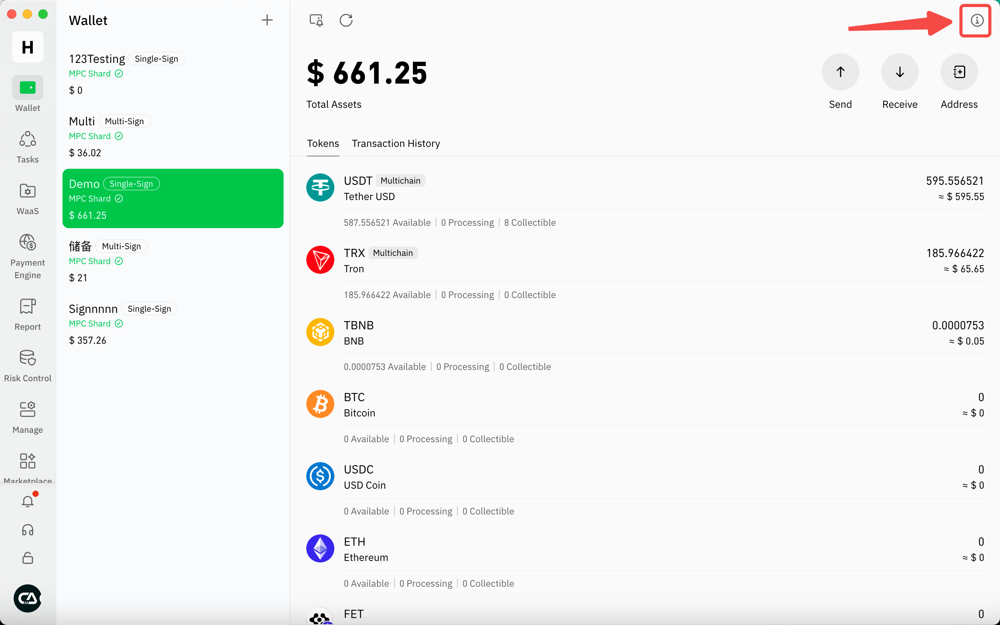

# 重置分片

重置分片会使所有之前的分片失效，只有用于重置的设备会产生新分片。重置分片时需要所有钱包创建人参与，同时分片数量需达到签名门槛。多签钱包于分片重置后会产生新的助记词，单签钱包则只会继续用旧有的助记词。&#x20;

## 单签钱包

先点击右上角进入钱包信息页面

<figure><figcaption></figcaption></figure>

然后点击分片管理的重置功能 

<figure><figcaption></figcaption></figure>

然后，您可以输入此钱包的助记词来重置分片。

<figure><figcaption></figcaption></figure>

输入正确的助记词后，会弹出身份验证窗口。完成身份验证后，分片将被重置。

## 多签钱包

多签钱包支持两种重置方式，分别是使用助记词重置分片及使用分片同时重置分片及助记词

<table><thead><tr><th width="197.55078125">重置方式</th><th width="229.09375">适用场景</th><th width="246.62890625">重置要求</th><th width="204.15625">重置后旧分片是否有效</th><th width="194.7421875">重置后助记词是否有效</th></tr></thead><tbody><tr><td>仅重置分片</td><td>当任何一个钱包创建人持有的分 片设备损坏或遗失</td><td>所有钱包创建人参与，并且导入助记词</td><td>失效</td><td>助记词不变</td></tr><tr><td>重置分片和助记词</td><td>当有任何一个创建人遗失助记词 时</td><td>所有钱包创建人参与，并且持有分片的 设备达到签名门限</td><td>失效</td><td>生成新的助记词，但旧 助记词依然有效，请注 意</td></tr></tbody></table>

注意<mark style="color:green;">**使用分片重置**</mark>多签钱包会产生新的助记词，根据用户钱包有所不同：

* 不支持添加TON、SUI链的钱包：只有一套助记词，重置时也只会重新生成一套助记词。
* 线上支持添加TON、SUI链的钱包：需使用有该钱包分片的设备进行重置操作，重置时会为您生成两套助记词，后续可正常使用恢复功能
* 新用户创建钱包时直接有两套助记词，重置后会生成新的助记词。

&#x20;<mark style="color:green;">**请注意助记词重置后，旧与新的助记词都可以用于恢复钱包并操作资产，所以必须小心保管好所有助记词。**</mark>

操作流程：

先点击右上角进入钱包信息页面

<figure><figcaption></figcaption></figure>

然后点击重置功能

<figure><figcaption></figcaption></figure>

点击后会弹出重置视窗，您可以选择使用助记词或使用分片进行重置，两者分别可参考上述简介。

<figure><figcaption></figcaption></figure>

### 使用助记词重置

选择使用助记词重置后进入等待画面，这里需要等待所有钱包创建人上线，请注意，所有钱包创建人必须都切换到当前团队，才会判定为在线。

<figure><figcaption></figcaption></figure>

所有人上线后即可发送邀请，其他创建人可在自己的设备上接受邀请。

<figure><figcaption></figcaption></figure>

所有创建人都接受邀请后，发起人的画面会转为准备就绪，即可开始重置流程。

<figure><figcaption></figcaption></figure>

开始后进入输入助记词流程，注意支持添加TON、SUI链的钱包会有两套助记词，较早期创建的则只有一套助记词。

<figure><figcaption></figcaption></figure>

完成助记词输入后，需等待所有创建人完成输入

<figure><figcaption></figcaption></figure>

所有成员完成输入助记词后，画面会出现准备就绪，发起人即可开始验证助记词及重置

<figure><figcaption></figcaption></figure>

注意只要任意创建人的助记词校验失败，流程都需要重新验证。

<figure><figcaption></figcaption></figure>

助记词校验成功后，新的分片会在当前设备生成，包括已授权的旧分片将全部失败，如有需要请重新进行分片授权。

<figure><figcaption></figcaption></figure>

### 使用分片重置

选择使用分片重置后进行进入等待画面，这里需要等待所有钱包创建人上线，请注意，所有钱包创建人必须都切换到当前团队，才会判定为在线。

<figure><figcaption></figcaption></figure>

当所有人在线后即可发送邀请

<figure><figcaption></figcaption></figure>

点击发送邀请后需要进行交易密码认证

<figure><figcaption></figcaption></figure>

完成验证后需等待其他钱包创建人加入，其他创建人加入时亦需进行交易密码验证。请注意最后需要足够成员进行签名，建议加入时使用有分片的设备。

<figure><figcaption></figcaption></figure>

所有创建人加入后，画面会转为准备就绪，并展示当前已加入成员设备的分片状态，当所有人已加入且分片数量满足决策模式时，发起人即可开始重置。

<figure><figcaption></figcaption></figure>

开始后系统会重置分片，然后生成新助记词。

<figure><figcaption></figcaption></figure>

请确保你的环境安全，点击了解后可开始备份新助记词。

<figure><figcaption></figcaption></figure>

<figure><figcaption></figcaption></figure>

备份完成后需验证助记词

<figure><figcaption></figcaption></figure>

完成备份后需等待其他成员完成

<figure><figcaption></figcaption></figure>

当所有成员完成，系统会弹出安全提醒，请注意旧的助记词仍然有效且可被用来恢复钱包资产。

点撃确定后完成分片重置流程。

<figure><figcaption></figcaption></figure>

