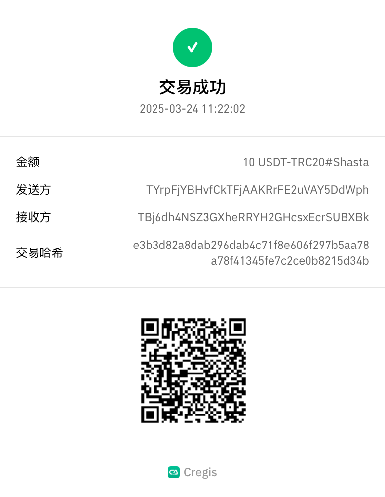

# 发送及接收

## 发送交易

### 单笔转账

1.  选择进行转账的钱包，点击“<mark style="color:green;">**发送**</mark>”按钮。这里的发送没有分片也可以操作，只要有钱包的发送权限即可发起交易。 

    <figure><figcaption></figcaption></figure>
2.  选择币种 

    <figure><figcaption></figcaption></figure>
3.  选择网络\
     

    <figure><figcaption></figcaption></figure>
4.  输入接收方地址，你可以选择从地址簿、团队的内部地址以及最近交易中选择地址。 

    <figure><figcaption></figcaption></figure>
5.  输入交易金额，这里可同时输入备注。 

    <figure><figcaption></figcaption></figure>
6.  最后确认交易 

    <figure><figcaption></figcaption></figure>
7. 提交交易请求后，请前往协作页面查看处理，详细流程请[参考](https://support.cregis.com/cregis-wallet-guide/zh-cn/team/teamwork/transaction_signing)。

### 批量转账

1.  点击“**发送**”开始，注意批量转账只可在单签钱包操作。这里的发送没有分片也可以操作，只要有钱包的发送权限即可发起交易。 

    <figure><figcaption></figcaption></figure>

2.  选择您想接收的币种 

    <figure><figcaption></figcaption></figure>

3.  选择网络 

    <figure><figcaption></figcaption></figure>
4.  点击批量转账后会有一个电子表格，用户可选择手动输入或上传表单，注意每次交易最多只可包含99条地址。 

    <figure><figcaption></figcaption></figure>

*   手动输入\
    需输入地址以及金额，资金用途及备注则可视乎需要填写。 

    <figure><figcaption></figcaption></figure>
*   上传表单\
    可到以下位置下载模版，你亦可参考模版中第二张表的模版说明。 

    <figure><figcaption></figcaption></figure>

    <figure><figcaption></figcaption></figure>

5.  点击继续后需做最终确认，确认后进行双重验证即可成功发起交易。 

    <figure><figcaption></figcaption></figure>

## 接收款项

1.  点击“<mark style="color:green;">**接收**</mark>”开始 

    <figure><figcaption></figcaption></figure>
2.  选择您想接收的币种 

    <figure><figcaption></figcaption></figure>
3.  选择网络\
     

    <figure><figcaption></figcaption></figure>
4.  然后可查看到地址，点击复制或扫描二维码。 

    <figure><figcaption></figcaption></figure>

如需使用其他地址进行收款，可以前往[**地址簿**](../../risk_management/address_book.md)生成新地址或将其设置为默认收款地址。

## **查看交易记录**

点击交易详情可以查看矿工费用和 TxID 等详细信息。 

<figure><figcaption></figcaption></figure>

<figure><figcaption></figcaption></figure>

## 下载交易凭证

你可以到交易记录分页底部下载交易凭证

<figure><figcaption></figcaption></figure>

<figure><figcaption></figcaption></figure>
