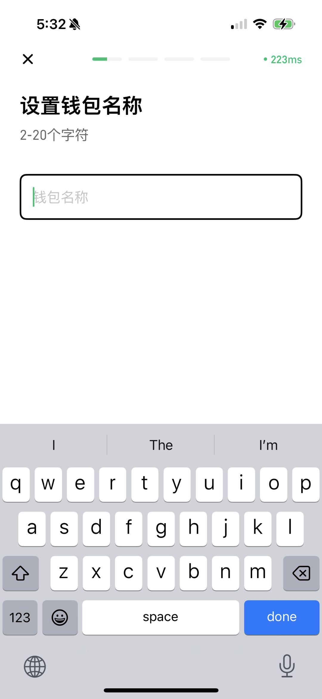
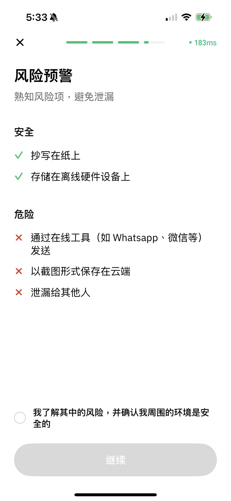

# 创建钱包

## Cregis PC客户端操作

如需创建钱包，请从左侧导航栏进入钱包页面。

<figure><figcaption></figcaption></figure>

可点击 **"+"** 图标新增钱包。

<figure><figcaption></figcaption></figure>

您可选择创建**单签钱包**或**多签钱包**，两者的区别可[这里](./)。

<figure><figcaption></figcaption></figure>

### 单签钱包创建流程 

单签钱包是一种加密货币钱包，仅需一个私钥即可授权交易。 

1.  为钱包设置一个易识别的名称。 

    <figure><figcaption></figcaption></figure>
2.  仔细阅读助记词风险警示，确认理解后继续。 

    <figure><figcaption></figcaption></figure>
3.  系统生成15个助记词，请用纸笔准确抄写并妥善保管。<mark style="color:green;">**助记词代表了钱包资产的所有权，非常重要，请妥善保管。Cregis系统不会为用户记录助记词，一旦遗失助记词可能会导致资产遗失，平台亦无法替用户找回。**</mark>完成记录后，点击继续进入下一步。 

    <figure><figcaption></figcaption></figure>
4.  按提示选择正确位置的单词，确保备份无误。 

    <figure><figcaption></figcaption></figure>
5.  完成验证后系统开始生成分片，分片生成后需输入密码完成身份验证

    <figure><figcaption></figcaption></figure>

    <figure><figcaption></figcaption></figure>
6.  完成身份认证后系统将生成钱包并自动添加主流币种。

    <figure><figcaption></figcaption></figure>

### 多签钱包创建流程 

多签钱包是一种加密货币钱包，要求多个私钥来授权交易。与仅需一个私钥的单签钱包相比，多签钱包提供了额外的安全层。在创建多签钱包之前，请确保所有参与者都在线以完成钱包创建。

1.  为多签钱包设置名称。 

    <figure><figcaption></figcaption></figure>
2.  从当前团队中选择在线的参与者（需确保其设备已连接）。 

    <figure><figcaption></figcaption></figure>

3.  选择参与者后可以设置下方的签名门槛。签名门槛指的是需要多少人同意才能使用钱包中的资金。设置签名门槛后，点击“确认”以发送邀请。您可以选择3名参与者，但只需2个签名即可批准。\
    请注意，批准所需的签名数不能超过参与者的数量。另外，请确保所有参与者都在线以完成钱包的创建。 

    <figure><figcaption></figcaption></figure>
4.  点击确认后，邀请将发送给参与者。创建者将进入等待页面，并需等待参与者加入。在此过程中，弹出窗口不能关闭，否则钱包创建将失败。 

    <figure><figcaption></figcaption></figure>

    被邀请者可在钱包页面看到通知，点击后同意加入即可开始创建。

    <figure><figcaption></figcaption></figure>

    <figure><figcaption></figcaption></figure>
5.  当所有参与者加入后，点击“开始”按钮。 

    <figure><figcaption></figcaption></figure>
6.  开始后页面会先进入生成分片页面，然后会出现助记词风险警示，请细心阅读内容，然后点击确认了解进入下一步。 

    <figure><figcaption></figcaption></figure>

    <figure><figcaption></figcaption></figure>
7.  多签钱包的助记词有**两套**，分别为secp256k1及ed25519助记词，每套由**24个单词**组成，每个参与者拥有不同的助记词。请妥善保管您的助记词，备份完成后点击“备份成功”。 

    <figure><figcaption></figcaption></figure>

8.  为了确保您已备份助记词，系统将随机选择5组助记词进行验证。请根据您备份的助记词选择正确的词组，验证完两组后需进行交易密码身份认证，认证成功则创建完成。 

    <figure><figcaption></figcaption></figure>

    <figure><figcaption></figcaption></figure>
9.  创建完成后系统将生成钱包并自动添加主流币种。

    <figure><figcaption></figcaption></figure>

## Cregis 手机端操作

首先进入资产页面，初始页面可直接点击“开始”，然后选择你想创建的钱包类型，两者的区别可参考此处。

<figure><figcaption></figcaption></figure>

若非初始页面，则可在选择钱包的位置找到创建钱包的入口。

<figure><figcaption></figcaption></figure>

### **单签钱包创建流程**

先设置钱包名称，随后会出现风险预警提示，请仔细阅读助记词风险警示，点击确认了解后继续。

<figure><figcaption></figcaption></figure>

<figure><figcaption></figcaption></figure>

进入备份助记词的页面。单签钱包共有15个助记词，请用纸笔准确抄写并妥善保管。助记词代表钱包资产的所有权，非常重要，请务必保管好。Cregis系统不会为用户备份助记词，一旦遗失助记词可能导致资产丢失，平台也无法为用户找回。完成备份后，点击继续根据提示进行助记词验证。

<figure><figcaption></figcaption></figure>

完成助记词验证后，系统将开始生成分片，随后需要进行交易密码验证。验证成功后即可完成钱包创建。

<figure><figcaption></figcaption></figure>

创建成功后，我们会为您添加热门代币，后续您也可在钱包的币种管理中进行配置。

<figure><figcaption></figcaption></figure>

### **多签钱包创建流程**

先设置好钱包名称，然后点击继续。

<figure><figcaption></figcaption></figure>

从当前团队中选择在线的参与者（需确保其设备已连接）。选择参与者后可以设定下方的签名门槛。签名门槛指的是需要多少人同意才能使用钱包中的资金。设定签名门槛后，点击“确认”以发送邀请。您可以选择3名参与者，但只需2个签名即可批准。\
请注意，批准所需的签名数不能超过参与者的数量。另外，请确保所有参与者都在线以完成钱包的建立。

<figure><figcaption></figcaption></figure>

点击确认后，邀请将发送给参与者。建立者将进入等待页面，并需等待参与者加入。在此过程中，弹窗不可关闭，否则钱包建立将失败。当所有参与者加入后，点击“开始”按钮，系统将开始生成分片。

<figure><figcaption></figcaption></figure>

被邀请者可在钱包页面看到通知，点击后同意加入即可开始建立。

<figure><figcaption></figcaption></figure>

开始后页面会先进入生成分片页面，随后会出现助记词风险警示，请细心阅读内容，然后点击确认了解并进入下一步。

<figure><figcaption></figcaption></figure>

多签钱包的助记词有两套，分别为 **secp256k1** 及 **ed25519** 助记词，每套由24个单词组成，每个参与者拥有不同的助记词。请妥善保管您的助记词，备份完成后点击“备份成功”。

<figure><figcaption></figcaption></figure>

<figure><figcaption></figcaption></figure>

验证完两组助记词后，需进行交易密码身份认证。认证成功后，等待所有成员验证完成，系统将生成钱包并自动添加主流币种。

<figure><figcaption></figcaption></figure>
